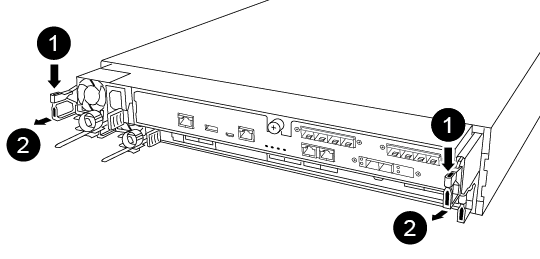
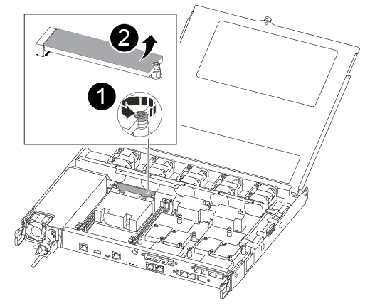
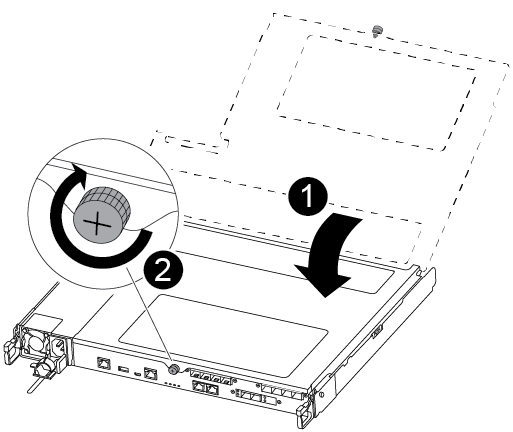

The boot media is located inside the controller module under the air duct, and is accessed by removing the controller module from the system.

. If you are not already grounded, properly ground yourself.
. Unplug the controller module power supplies from the source.
. Release the power cable retainers, and then unplug the cables from the power supplies.
. Unplug the I/O cables from the controller module.
. Insert your forefinger into the latching mechanism on either side of the controller module, press the lever with your thumb, and gently pull the controller a few inches out of the chassis.
+
NOTE: If you have difficulty removing the controller module, place your index fingers through the finger holes from the inside (by crossing your arms).
+

+

[cols="1,4"]
|===
a|
image:../media/icon_round_1.png[Callout number 1] 
a|
Lever
a|
image:../media/icon_round_2.png[Callout number 2]
a|
Latching mechanism
|===

. Using both hands, grasp the controller module sides and gently pull it out of the chassis and set it on a flat, stable surface.
. Turn the thumbscrew on the front of the controller module anti-clockwise and open the controller module cover.
+
image::../media/drw_a250_open_controller_module_cover.png[Opening the controller module cover]
+

[cols="1,4"]
|===
a|
image:../media/icon_round_1.png[Callout number 1] 
a|
Thumbscrew
a|
image:../media/icon_round_2.png[Callout number 2]
a|
Controller module cover.
|===

. Lift out the air duct cover.

+
image::../media/drw_a250_remove_airduct_cover.png[Lifting out the air duct cover]

You can use the following video or the tabulated steps to replace the boot media:

video::7c2cad51-dd95-4b07-a903-ac5b015c1a6d[panopto, title="Animation - Replace the boot media"]

. Locate and replace the impaired boot media from the controller module and replace it:
+
NOTE: You need a #1 magnetic Phillips head screwdriver to remove the screw that holds the boot media in place. Due to the space constraints within the controller module, you should also have a magnet to transfer the screw on to so that you do not lose it.
+

+
[cols="1,3"]
|===
a|
image:../media/icon_round_1.png[Callout number 1]
a|
Remove the screw securing the boot media to the motherboard in the controller module.
a|
image:../media/icon_round_2.png[Callout number 2]
a|
Lift the boot media out of the controller module.
|===

.. Using the #1 magnetic screwdriver, remove the screw from the impaired boot media, and set it aside safely on the magnet.
.. Gently lift the impaired boot media directly out of the socket and set it aside.
.. Remove the replacement boot media from the antistatic shipping bag and align it into place on the controller module.
.. Using the #1 magnetic screwdriver, insert and tighten the screw on the boot media.
+
Do not over-tighten the screw or you might damage the boot media.

.. Install the air duct.
+
image::../media/drw_a250_install_airduct_cover.png[Installing the air duct]

.. Close the controller module cover and tighten the thumbscrew.
+

+
[cols="1,3"]
|===
a|
image:../media/icon_round_1.png[Callout number 1]
a|
Controller module cover
a|
image:../media/icon_round_2.png[Callout number 2]
a|
Thumbscrew
|===

. Install the controller module:
.. Align the end of the controller module with the opening in the chassis, and then gently push the controller module halfway into the system.
.. Push the controller module all the way into the chassis:
.. Place your index fingers through the finger holes from the inside of the latching mechanism.
.. Press your thumbs down on the orange tabs on top of the latching mechanism and gently push the controller module over the stop.
.. Release your thumbs from the top of the latching mechanisms and continue pushing until the latching mechanisms snap into place.
+
The controller module should be fully inserted and flush with the edges of the chassis.
. Reconnect the controller module I/O cables.

. Plug the power cords into the power supplies, reinstall the power cable locking collar, and then connect the power supplies to the power source.
+
The controller module begins to boot and stops at the LOADER prompt.

