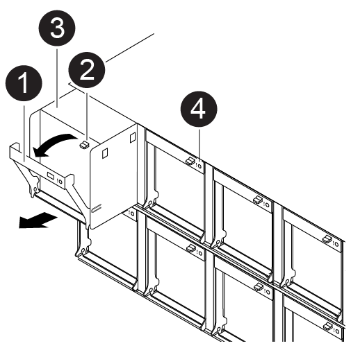

To swap out a fan module without interrupting service, you must perform a specific sequence of tasks.

NOTE: You must replace the fan module within two minutes of removing it from the chassis. System airflow is disrupted and the controller module or modules shut down after two minutes to avoid overheating.

You can use the following animation, illustration, or the written steps to hot-swap a fan module.

video::ae59d53d-7746-402c-bd6b-aad9012efa89[panopto, title="Animation - Replace a fan"]

[cols="10,90"]
|===
a|
image:../media/icon_round_1.png[Callout number 1]
a|
Fan handle
a|
image:../media/icon_round_2.png[Callout number 2]
a|
Locking tab
a|
image:../media/icon_round_3.png[Callout number 3]
a|
Fan
a|
image:../media/icon_round_4.png[Callout number 4]
a|
Status LED
|===

.Steps
. If you are not already grounded, properly ground yourself.
. Remove the bezel (if necessary) with two hands, by grasping the openings on each side of the bezel, and then pulling it toward you until the bezel releases from the ball studs on the chassis frame.

. Identify the fan module that you must replace by checking the console error messages and looking at the Attention LED on each fan module.
+
Use the BMC message or the Attention LED to identify the fan module to replace. BMC maps fan modules as Fan#_# where the first number is the slot and the second is the row (1=top, 2=bottom); for example, slot 1, second row = Fan1_2.
. Press down the release latch on the fan module cam handle, and then rotate the cam handle downward.
+
The fan module moves slightly away from the chassis.

. Pull the fan module straight out from the chassis, making sure that you support it with your free hand so that it does not swing out of the chassis.
+
CAUTION: The fan modules are short. Always support the bottom of the fan module with your free hand so that it does not suddenly drop free from the chassis and injure you.

. Set the fan module aside.
. Insert the replacement fan module into the chassis by aligning it with the opening, and then sliding it into the chassis.
. Push firmly on the fan module cam handle so that it is seated all the way into the chassis.
+
The cam handle raises slightly when the fan module is completely seated.

. Swing the cam handle up to its closed position, making sure that the cam handle release latch clicks into the locked position.
+
The Attention LED turns off after the fan is seated and spins up to operational speed.

. Align the bezel with the ball studs, and then gently push the bezel onto the ball studs.

include::../_include/complete_rma_step.adoc[]
