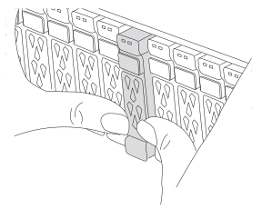
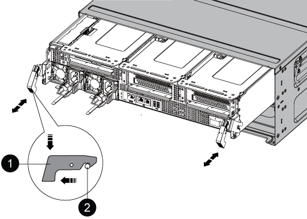

// Remove the controller module - AFF A800

You must remove the controller module from the chassis when you replace the controller module or replace a component inside the controller module.

.Steps

You must remove the controller module from the chassis when you replace the controller module or replace a component inside the controller module.

. If you are not already grounded, properly ground yourself.
. Ensure that all drives in the chassis are firmly seated against the midplane by using your thumbs to push each drive until you feel a positive stop.
// ontap-systems/issues/343

+
video::2c46e4af-2c21-4f12-b065-b38b003d0ea2[panopto, title="Video - Seating the drives before removing the controller module"]

+

+

. Unplug the controller module power supplies from the source.
. Release the power cable retainers, and then unplug the cables from the power supplies.
. Loosen the hook and loop strap binding the cables to the cable management device, and then unplug the system cables and SFP and QSFP modules (if needed) from the controller module, keeping track of where the cables were connected.
+
Leave the cables in the cable management device so that when you reinstall the cable management device, the cables are organized.

. Remove the cable management device from the controller module and set it aside.
. Press down on both of the locking latches, and then rotate both latches downward at the same time.
+
The controller module moves slightly out of the chassis.
+

+

[cols="1,4"]
|===
a|
image:../media/icon_round_1.png[Callout number 1]
a|
Locking latch
a|
image:../media/icon_round_2.png[Callout number 2]
a|
Locking pin
|===

. Slide the controller module out of the chassis and place it on a stable, flat surface.
+
Make sure that you support the bottom of the controller module as you slide it out of the chassis.
