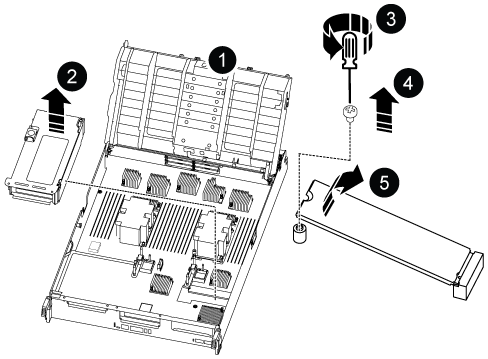

.Steps

. Locate the boot media under Riser 3.
+

+

[cols="1,4"]
|===
a|
image:../media/icon_round_1.png[Callout number 1]
a|
Air duct
a|
image:../media/icon_round_2.png[Callout number 2]
a|
Riser 3
a|
image:../media/icon_round_3.png[Callout number 3]
a|
Phillips #1 screwdriver
a|
image:../media/icon_round_4.png[Callout number 4]
a|
Boot media screw
a|

a|
Boot media
|===

. Remove the boot media from the controller module:

 .. Using a #1 Phillips head screwdriver, remove the screw holding down the boot media and set the screw aside in a safe place.
 .. Grasping the sides of the boot media, gently rotate the boot media up, and then pull the boot media straight out of the socket and set it aside.
. Move the boot media to the new controller module and install it:
 .. Align the edges of the boot media with the socket housing, and then gently push it squarely into the socket.
 .. Rotate the boot media down toward the motherboard.
 .. Secure the boot media to the motherboard using the boot media screw.
+
Do not over-tighten the screw or you might damage the boot media.

//2025-11-25 ontap-systems-internal/1315 and ontap-systems-internal/1380
