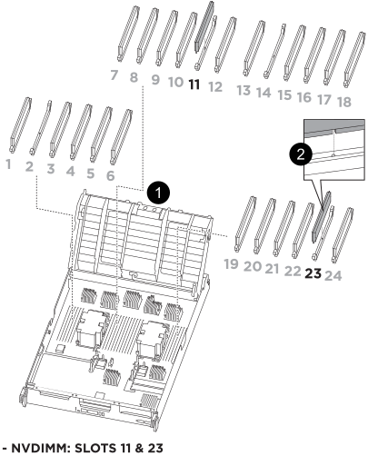

.Steps

. Locate the NVDIMMs on your controller module.
+

+

[cols="1,4"]
|===
a|
image:../media/icon_round_1.png[Callout number 1]
a|
Air duct
a|
image:../media/icon_round_2.png[Callout number 2]
a|
NVDIMMs
|===

. Note the orientation of the NVDIMM in the socket so that you can insert the NVDIMM in the replacement controller module in the proper orientation.
. Eject the NVDIMM from its slot by slowly pushing apart the two NVDIMM ejector tabs on either side of the NVDIMM, and then slide the NVDIMM out of the socket and set it aside.
+
NOTE: Carefully hold the NVDIMM by the edges to avoid pressure on the components on the NVDIMM circuit board.

. Locate the slot where you are installing the NVDIMM.
. Insert the NVDIMM squarely into the slot.
+
The NVDIMM fits tightly in the slot, but should go in easily. If not, realign the NVDIMM with the slot and reinsert it.
+
NOTE: Visually inspect the NVDIMM to verify that it is evenly aligned and fully inserted into the slot.

. Push carefully, but firmly, on the top edge of the NVDIMM until the ejector tabs snap into place over the notches at the ends of the NVDIMM.
. Repeat the preceding steps to move the other NVDIMM.

//2025-11-25 ontap-systems-internal/1315 and ontap-systems-internal/1380
