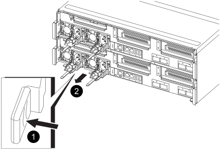

.Steps

. Rotate the cam handle such that it can be used to pull power supply out of the controller module while pressing the locking tab.
+
CAUTION: The power supply is short. Always use two hands to support it when removing it from the controller module so that it does not suddenly swing free from the controller module and injure you.
+

+

[cols="1,4"]
|===
a|
image:../media/icon_round_1.png[Callout number 1]
a|
Blue power supply locking tab
a|
image:../media/icon_round_2.png[Callout number 2]
a|
Power supply
|===

. Move the power supply to the new controller module, and then install it.
. Using both hands, support and align the edges of the power supply with the opening in the controller module, and then gently push the power supply into the controller module until the locking tab clicks into place.
+
The power supplies will only properly engage with the internal connector and lock in place one way.
+
NOTE: To avoid damaging the internal connector, do not use excessive force when sliding the power supply into the system.

//2025-11-25 ontap-systems-internal/1315 and ontap-systems-internal/1380
