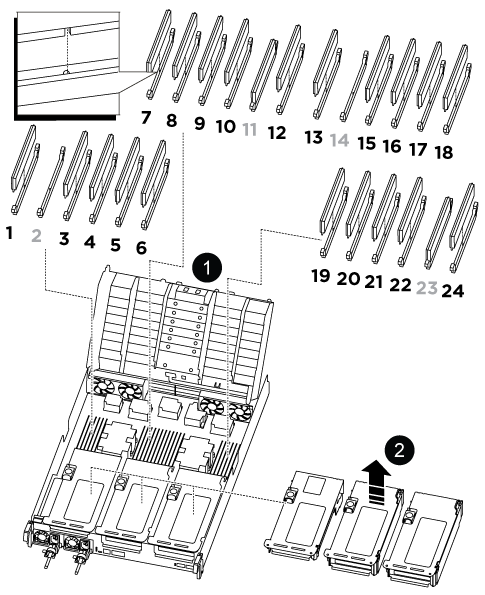

To replace a DIMM, you must locate it in the controller module using the DIMM map label on top of the air duct and then replace it following the specific sequence of steps.

. Open the air duct:
 .. Press in the locking tabs on the sides of the air duct toward the middle of the controller module.
 .. Slide the air duct toward the fan modules, and then rotate it upward to its completely open position. 
 
. When removing a DIMM, unlock the locking latch on the applicable riser, and then remove the riser.
+

+

[cols="1,4"]
|===
a|
image:../media/icon_round_1.png[Callout number 1]
a|
Air duct cover
a|
image:../media/icon_round_2.png[Callout number 2]
a|
Riser 1 and DIMM bank 1, and 3-6
a|
Riser 2 and DIMM bank 7-10, 12-13, and 15-18
a|
Riser 3 and DIMM 19 -22 and 24
|===
*Note:* Slot 2 and 14 are left empty. Do not attempt to install DIMMs into these slots.

. Note the orientation of the DIMM in the socket so that you can insert the replacement DIMM in the proper orientation.
. Eject the DIMM from its slot by slowly pushing apart the two DIMM ejector tabs on either side of the DIMM, and then slide the DIMM out of the slot.
+
NOTE: Carefully hold the DIMM by the edges to avoid pressure on the components on the DIMM circuit board.

. Remove the replacement DIMM from the antistatic shipping bag, hold the DIMM by the corners, and align it to the slot.
+
The notch among the pins on the DIMM should line up with the tab in the socket.

. Insert the DIMM squarely into the slot.
+
The DIMM fits tightly in the slot, but should go in easily. If not, realign the DIMM with the slot and reinsert it.
+
NOTE: Visually inspect the DIMM to verify that it is evenly aligned and fully inserted into the slot.

. Push carefully, but firmly, on the top edge of the DIMM until the ejector tabs snap into place over the notches at the ends of the DIMM.
. Reinstall any risers that you removed from the controller module.
. Close the air duct.

//2025-11-25 ontap-systems-internal/1315 and ontap-systems-internal/1380
