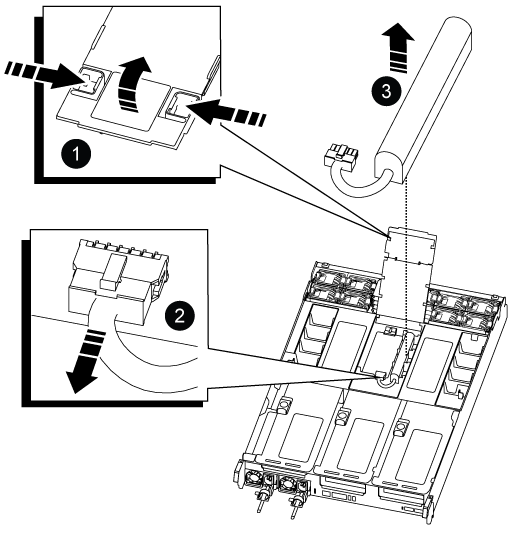

.Steps

. Open the air duct cover and locate the NVDIMM battery in the riser.
+

+

[cols="1,4"]
|===
a|
image:../media/icon_round_1.png[Callout number 1]
a|
Air duct riser
a|
image:../media/icon_round_2.png[Callout number 2]
a|
NVDIMM battery plug
a|
image:../media/icon_round_3.png[Callout number 3]
a|
NVDIMM battery pack
|===

*Attention:* The NVDIMM battery control board LED blinks while destaging contents to the flash memory when you halt the system. After the destage is complete, the LED turns off.

. Locate the battery plug and squeeze the clip on the face of the battery plug to release the plug from the socket, and then unplug the battery cable from the socket.
. Grasp the battery and lift the battery out of the air duct and controller module, and then set it aside.
. Remove the replacement battery from its package.
. Install the replacement battery pack in the NVDIMM air duct:
 .. Insert the battery pack into the slot and press firmly down on the battery pack to make sure that it is locked into place.
 .. Plug the battery plug into the riser socket and make sure that the plug locks into place.
. Close the NVDIMM air duct.
+
Make sure that the plug locks into the socket.
