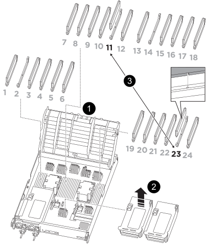

.Steps

. Access the NVDIMM by unlocking the locking latch on the appropriate riser, and then remove the riser.
+

+

[cols="1,4"]
|===
a|
image:../media/icon_round_1.png[Callout number 1]
a|
Air duct cover
a|
image:../media/icon_round_2.png[Callout number 2]
a|
Riser 2 
a|
image:../media/icon_round_3.png[Callout number 3]
a|
NVDIMM in slots 11 and 23

|===

. Note the orientation of the NVDIMM in the socket so that you can insert the NVDIMM in the replacement controller module in the proper orientation.
. Eject the NVDIMM from its slot by slowly pushing apart the two NVDIMM ejector tabs on either side of the NVDIMM, and then slide the NVDIMM out of the socket and set it aside.
+
NOTE: Carefully hold the NVDIMM by the edges to avoid pressure on the components on the NVDIMM circuit board.

. Remove the replacement NVDIMM from the antistatic shipping bag, hold the NVDIMM by the corners, and then align it to the slot.
+
The notch among the pins on the NVDIMM should line up with the tab in the socket.

. Locate the slot where you are installing the NVDIMM.
. Insert the NVDIMM squarely into the slot.
+
The NVDIMM fits tightly in the slot, but should go in easily. If not, realign the NVDIMM with the slot and reinsert it.
+
NOTE: Visually inspect the NVDIMM to verify that it is evenly aligned and fully inserted into the slot.

. Push carefully, but firmly, on the top edge of the NVDIMM until the ejector tabs snap into place over the notches at the ends of the NVDIMM.
. Reinstall any risers that you removed from the controller module.
. Close the air duct.

//2025-11-25 ontap-systems-internal/1315 and ontap-systems-internal/1380
