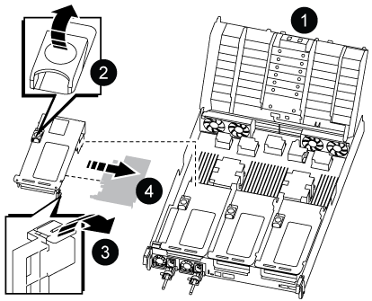
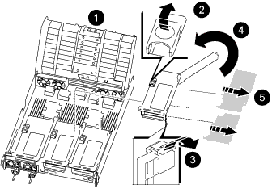

.Steps

. Determine if the card you are replacing is from Riser 1 or if it is from Riser 2 or 3.
 ** If you are replacing the 100GbE PCIe card in Riser 1, use Steps 2 - 3 and Steps 6 - 7.
 ** If you are replacing a PCIe card from Riser 2 or 3, use Steps 4 through 7.
. Remove Riser 1 from the controller module:
 .. Remove the QSFP modules that might be in the PCIe card.
 .. Rotate the riser locking latch on the left side of the riser up and toward the fan modules.
+
The riser raises up slightly from the controller module.

 .. Lift the riser up, shift it toward the fans so that the sheet metal lip on the riser clears the edge of the controller module, lift the riser out of the controller module, and then place it on a stable, flat surface.
+

+

[cols="1,4"]
|===
a|
image:../media/icon_round_1.png[Callout number 1]
a|
Air duct
a|
image:../media/icon_round_2.png[Callout number 2]
a|
Riser locking latch
a|
image:../media/icon_round_3.png[Callout number 3]
a|
Card locking bracket
a|
image:../media/icon_round_4.png[Callout number 4]
a|
Riser 1 (left riser) with 100GbE PCIe card in slot 1.
|===

. Remove the PCIe card from Riser 1:
 .. Turn the riser so that you can access the PCIe card.
 .. Press the locking bracket on the side of the PCIe riser, and then rotate it to the open position.
 .. Remove the PCIe card from the riser.
. Remove the PCIe riser from the controller module:
 .. Remove any SFP or QSFP modules that might be in the PCIe cards.
 .. Rotate the riser locking latch on the left side of the riser up and toward the fan modules.
+
The riser raises up slightly from the controller module.

 .. Lift the riser up, shift it toward the fans so that the sheet metal lip on the riser clears the edge of the controller module, lift the riser out of the controller module, and then place it on a stable, flat surface.
+

+

[cols="1,4"]
|===
a|
image:../media/icon_round_1.png[Callout number 1]
a|
Air duct
a|
image:../media/icon_round_2.png[Callout number 2]
a|
Riser 2 (middle riser) or 3 (right riser) locking latch
a|
image:../media/icon_round_3.png[Callout number 3]
a|
Card locking bracket
a|
image:../media/icon_round_4.png[Callout number 4]
a|
Side panel on riser 2 or 3
a|
image:../media/icon_round_5.png[Callout number 5]
a|
PCIe cards in riser 2 or 3
|===

. Remove the PCIe card from the riser:
 .. Turn the riser so that you can access the PCIe cards.
 .. Press the locking bracket on the side of the PCIe riser, and then rotate it to the open position.
 .. Swing the side panel off the riser.
 .. Remove the PCIe card from the riser.
. Install the PCIe card into the same slot in the riser:
 .. Align the card with the card socket in the riser, and then slide it squarely into the socket in the riser.
+
NOTE: Make sure that the card is completely and squarely seated into the riser socket.

 .. For Riser 2 or 3, close the side panel.
 .. Swing the locking latch into place until it clicks into the locked position.
. Install the riser into the controller module:
 .. Align the lip of the riser with the underside of the controller module sheet metal.
 .. Guide the riser along the pins in the controller module, and then lower the riser into the controller module.
 .. Swing the locking latch down and click it into the locked position.
+
When locked, the locking latch is flush with the top of the riser and the riser sits squarely in the controller module.

 .. Reinsert any SFP modules that were removed from the PCIe cards.

//2025-11-25 ontap-systems-internal/1315 and ontap-systems-internal/1380
