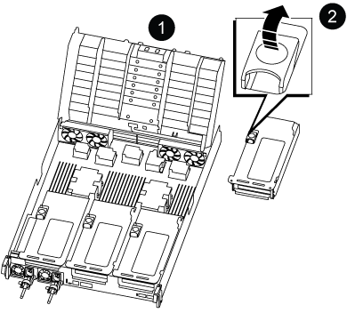
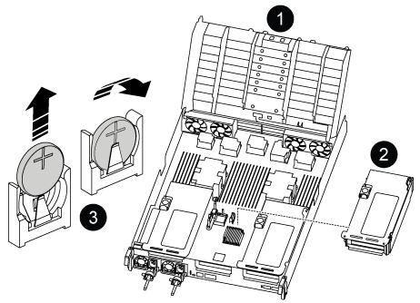
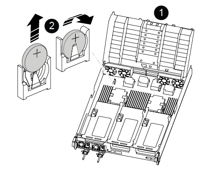

The procedure for replacing the RTC battery differs depending on whether your controller is a Original or VER2 model. Use the tabs below to select the appropriate instructions for your controller model.

// Added About this task for clarity

.About this task

The battery is located under Riser 2 (the middle riser) on Original controllers and near the DIMMs on VER2 controllers.

[role="tabbed-block"]
====

.Original controller
--

.Steps

. Remove PCIe riser 2 (middle riser) from the controller module:
 .. Remove any SFP or QSFP modules that might be in the PCIe cards.
 .. Rotate the riser locking latch on the left side of the riser up and toward the fan modules.
+
The riser raises up slightly from the controller module.

 .. Lift the riser up, shift it toward the fans so that the sheet metal lip on the riser clears the edge of the controller module, lift the riser out of the controller module, and then place it on a stable, flat surface.
+

+

[cols="1,4"]
|===
a|
image:../media/icon_round_1.png[Callout number 1]
a|
Air duct
a|
image:../media/icon_round_2.png[Callout number 2]
a|
Riser 2 (middle riser) locking latch
|===

. Locate the RTC battery under Riser 2.
+

+

[cols="1,4"]
|===
a|
image:../media/icon_round_1.png[Callout number 1]
a|
Air duct
a|
image:../media/icon_round_2.png[Callout number 2]
a|
Riser 2
a|
image:../media/icon_round_3.png[Callout number 3]
a|
RTC battery and housing
|===

. Gently push the battery away from the holder, rotate it away from the holder, and then lift it out of the holder.
+
NOTE: Note the polarity of the battery as you remove it from the holder. The battery is marked with a plus sign and must be positioned in the holder correctly. A plus sign near the holder tells you how the battery should be positioned.

. Remove the replacement battery from the antistatic shipping bag.
. Note the polarity of the RTC battery, and then insert it into the holder by tilting the battery at an angle and pushing down.
. Visually inspect the battery to make sure that it is completely installed into the holder and that the polarity is correct.
. Install the riser into the controller module:
 .. Align the lip of the riser with the underside of the controller module sheet metal.
 .. Guide the riser along the pins in the controller module, and then lower the riser into the controller module.
 .. Swing the locking latch down and click it into the locked position.
+
When locked, the locking latch is flush with the top of the riser and the riser sits squarely in the controller module.

 .. Reinsert any SFP modules that were removed from the PCIe cards.
--

.VER2 controller 
--

.Steps 
. Locate the RTC battery near the DIMMs.
+

+

[cols="1,4"]
|===
a|
image:../media/icon_round_1.png[Callout number 1]
a|
Air duct
a|
image:../media/icon_round_2.png[Callout number 2]
a|
RTC battery and housing
|===

. Gently push the battery away from the holder, rotate it away from the holder, and then lift it out of the holder.
+
NOTE: Note the polarity of the battery as you remove it from the holder. The battery is marked with a plus sign and must be positioned in the holder correctly. A plus sign near the holder tells you how the battery should be positioned.

. Remove the replacement battery from the antistatic shipping bag.
. Note the polarity of the RTC battery, and then insert it into the holder by tilting the battery at an angle and pushing down.
. Visually inspect the battery to make sure that it is completely installed into the holder and that the polarity is correct.
--

====

// end tabbed area
//2025-11-25 ontap-systems-internal/1315 and ontap-systems-internal/1380
