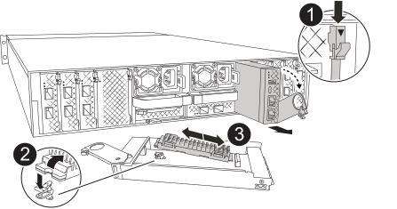

To replace the boot media, you must remove the impaired controller module, install the replacement boot media, and transfer the boot image to a USB flash drive.

== Step 1: Remove the controller module

**Removed--Ping Engineering on this.**

== Step 2: Replace the boot media

The boot media is located inside the System Management Module and is accessed by removing the module from the system.

. Remove the System Management Module:
+

+
[cols="1,4"]
|===
a|
image:../media/legend_icon_01.svg[Callout number 1] a|
System Management Module cam latch
a|
image:../media/legend_icon_02.svg[Callout number 2]
a|
Boot media locking button
a|
image:../media/legend_icon_03.svg[Callout number 3]
a|
Boot media

|===

.. If you are not already grounded, properly ground yourself.
.. Remove any cables connected to the System Management Module. Make sure that label where the cables were connected, so that you can connect them to the correct ports when you reinstall the module. 
.. Depress the terra cotta system management cam button.
The cam button moves away from the chassis.
 .. Rotate the cam lever all the way down and remove the System Management Module from the controller module.
.. Place the System Management Module on an anti-static mat, so that the boot media is accessible.
. Remove the boot media from the management module:
.. Press the blue locking button.
The boot media rotates slightly upward.
.. Rotate the boot media up,  slide it out of the socket, and set it aside.
. Install the replacement boot media into the controller module:
.. Align the edges of the boot media with the socket housing, and then gently push it squarely into the socket.
.. Rotate the boot media down toward the motherboard until it engages the locking button.
. Reinstall the System Management Module and recable it.

== Step 3: Transfer the boot image to the boot media

The replacement boot media that you installed is without a boot image so you need to transfer a boot image using a USB flash drive.

*QUESTIONS - Is Vino an e0M-16 model where we have to do an ifconfig at the LOADER prompt like the A900, or like an e0S system where we don't have to the ifconfig at the LOADER prompt?*

*Do we require an EFI folder on the USB drive?*

.Before you begin

 * You must have a USB flash drive, formatted to FAT32, with at least 4GB capacity.
 * A copy of the same image version of ONTAP as what the impaired controller was running. You can download the appropriate image from the Downloads section on the NetApp Support Site
  ** If NVE is enabled, download the image with NetApp Volume Encryption, as indicated in the download button.
  ** If NVE is not enabled, download the image without NetApp Volume Encryption, as indicated in the download button.
 * If your system is an HA pair, you must have a network connection.
 * If your system is a stand-alone system you do not need a network connection, but you must perform an additional reboot when restoring the var file system.
 
.Steps
. Download and copy the appropriate service image from the NetApp Support Site to the USB flash drive.
.. Download the service image to your work space on your laptop.
.. Unzip the service image.
+

NOTE: If you are extracting the contents using Windows, do not use WinZip to extract the netboot image. Use another extraction tool, such as 7-Zip or WinRAR.

+

There are two folders in the unzipped service image file:

+

   *** boot
   *** efi

  .. Copy the efi folder to the top directory on the USB flash drive.
  +
 The USB flash drive should have the efi folder and the same Service Image (BIOS) version of what the impaired controller is running.

  .. Remove the USB flash drive from your laptop.
 . Plug the power cable into the power supply and reinstall the power cable retainer.
 . Insert the USB flash drive into the USB slot on the controller module.
+
Make sure that you install the USB flash drive in the slot labeled for USB devices, and not in the USB console port.

 . Gently push the controller module all the way into the system until the controller module locking hooks begin to rise, firmly push on the locking hooks to finish seating the controller module, and then swing the locking hooks into the locked position over the pins on the controller module.
+
The controller begins to boot as soon as it is completely installed into the chassis.

 . Interrupt the boot process by pressing Ctrl-C to stop at the LOADER prompt.
+
If you miss this message, press Ctrl-C, select the option to boot to Maintenance mode, and then halt the controller to boot to LOADER.
