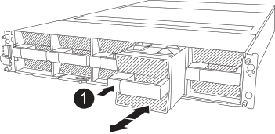

To replace the controller, you must remove the impaired controller, move FRU components to the replacement controller module, install the replacement controller module in the enclosure, and then boot the system to Maintenance mode.

== Step 1 Remove the controller module

include::../_include/a1k_controller_remove_physical.adoc[]

== Step 2: Move the fans

You must remove the five fan modules from the impaired controller module to the replacement controller module.

. If you are not already grounded, properly ground yourself.
. Remove the bezel (if necessary) with two hands, by grasping the openings on each side of the bezel, and then pulling it toward you until the bezel releases from the ball studs on the chassis frame.
. Press the gray locking button on the fan module and pull the fan module straight out of the chassis, making sure that you support it with your free hand.

+

NOTE: The fan modules are short. Always support the bottom of the fan module with your free hand so that it does not suddenly drop free from the chassis and injure you.

+

+
[cols="1,4"]
|===
a|
image::../media/legend_icon_01.svg[Callout number 1,width=30x] 
a|
Black locking button
|===

. Install the fan in the replacement controller module:
.. Align the edges of the fan housing with the opening in the front of the replacement controller module.
.. Gently slide the fan module all the way into the replacement controller module until it locks in place.
. Repeat the preceding steps for the remaining fan modules. 

== Step 3: Move the NV battery

Move the NV battery to the replacement controller.

. Open the NV battery air duct cover and locate the NV battery.
+
image::../media/drw_a1k_remove_replace_nvmembat_ieops-1379.svg[NV battery remove AFF A1K ]
+
[cols="1,4"]
|===
a|
image::../media/legend_icon_01.svg[Callout number 1,width=30x]
|
NV battery air duct cover
a|
image::../media/legend_icon_02.svg[Callout number 2,width=30x]
a|
NV battery plug
a|
image::../media/legend_icon_03.svg[Callout number 3,width=30x]
a|
NV battery pack
|===

+

. Lift the battery up to access the battery plug.
. Squeeze the clip on the face of the battery plug to release the plug from the socket, and then unplug the battery cable from the socket.
. Lift the battery out of the air duct and controller module.
. Move the battery pack to the replacement controller module and then install it in the NV battery air duct:
.. Open the NV battery air duct in the replacement controller module.
.. Plug the battery plug into the socket and make sure that the plug locks into place.
 .. Insert the battery pack into the slot and press firmly down on the battery pack to make sure that it is locked into place.
 
 .. Close the air duct cover.

== Step 4: Move system DIMMs

Move the DIMMs to the replacement controller module.

. Open the motherboard air duct and locate the DIMMs.
+
image::../media/drw_a1k_dimms_ieops-1512.svg[DIMM remove AFF A1K]
+
[cols="1,4"]
|===
a|
image::../media/legend_icon_01.svg[Callout number 1,width=30x]
a|
System DIMM
|===

. Note the orientation of the DIMM in the socket so that you can insert the DIMM in the replacement controller module in the proper orientation.
. Eject the DIMM from its slot by slowly pushing apart the two DIMM ejector tabs on either side of the DIMM, and then slide the DIMM out of the slot.

+
NOTE: Carefully hold the DIMM by the edges to avoid pressure on the components on the DIMM circuit board.
+

. Locate the slot where you are installing the DIMM in the replacement controller module.
. Insert the DIMM squarely into the slot.
+
The DIMM fits tightly in the slot, but should go in easily. If not, realign the DIMM with the slot and reinsert it.

+
NOTE: Visually inspect the DIMM to verify that it is evenly aligned and fully inserted into the slot.
+

. Push carefully, but firmly, on the top edge of the DIMM until the ejector tabs snap into place over the notches at the ends of the DIMM.
. Repeat these steps for the remaining DIMMs.
Close the motherboard air duct.

== Step 5: Install the controller module

include::../_include/a1k_controller_install_step_physical.adoc[]

