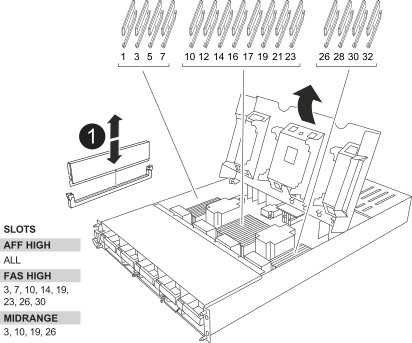

You must replace a DIMM in the controller module when your system registers an increasing number of correctable error correction codes (ECC); failure to do so causes a system panic.

.Before you begin

All other components in the system must be functioning properly; if not, you must contact technical support.

You must replace the failed component with a replacement FRU component you received from your provider.

== Step 1: Shut down the impaired controller

Shut down or take over the impaired controller using one of the following options.

[role="tabbed-block"]
====

.Option 1: Most systems
--
include::../_include/shutdown_most_frus.adoc[]
--
.Option 2: Controller is in a MetroCluster
--
include::../_include/shutdown_any_mcc_supported.adoc[]
--

====

== Step 2: Remove the controller module

include::../_include/a1k_controller_remove_physical.adoc[]

== Step 3: Replace the DIMMs

To replace the DIMMs, locate them inside the controller and follow the specific sequence of steps.

NOTE: The VER2 controller has fewer DIMM sockets. There is no reduction in the number of DIMMs supported or change in the DIMM socket numbering. When moving the DIMMs to the new controller module, install the DIMMs into the same socket number/location as the impaired controller module.  See the FRU map diagram on the VER2 controller module for DIMM socket locations.

. If you are not already grounded, properly ground yourself.
. Locate the DIMMs on your controller module.

. Eject the DIMM from its slot by slowly pushing apart the two DIMM ejector tabs on either side of the DIMM, and then slide the DIMM out of the slot.
+
IMPORTANT: Carefully hold the DIMM by the edges to avoid pressure on the components on the DIMM circuit board.
+

+

+
[cols="1,4"]
|===
a|
image:../media/legend_icon_01.svg[Callout number 1, width=30px] 
a|
DIMMs
|===

. Remove the replacement DIMM from the antistatic shipping bag, hold the DIMM by the corners, and align it to the slot.
+
The notch among the pins on the DIMM should line up with the tab in the socket.

. Make sure that the DIMM ejector tabs on the connector are in the open position, and then insert the DIMM squarely into the slot.
+
The DIMM fits tightly in the slot, but should go in easily. If not, realign the DIMM with the slot and reinsert it.
+
IMPORTANT: Visually inspect the DIMM to verify that it is evenly aligned and fully inserted into the slot.

. Push carefully, but firmly, on the top edge of the DIMM until the ejector tabs snap into place over the notches at the ends of the DIMM.
. Close the controller module cover.

== Step 4: Install the controller

include::../_include/a1k_controller_install_step_physical.adoc[]

== Step 5: Return the failed part to NetApp

include::../_include/complete_rma.adoc[]
