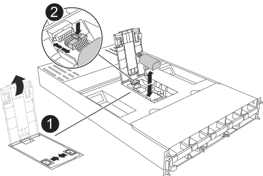

To replace the NVDIMM battery, you must remove the controller module, remove the battery, replace the battery, and then reinstall the controller module.

All other components in the system must be functioning properly; if not, you must contact technical support.

== Step 1: Shut down the impaired controller

Shut down or take over the impaired controller using one of the following options.

[role="tabbed-block"]
====

.Option 1: Most systems
--
include::../_include/shutdown_most_frus.adoc[]
--
.Option 2: Controller is in a MetroCluster
--
include::../_include/shutdown_any_mcc_supported.adoc[]
--

====

== Step 2: Remove the controller module

include::../_include/a1k_controller_remove_physical.adoc[]

== Step 3: Replace the NVDIMM battery

Remove the failed NVDIMM battery from the controller module and install the replacement NVDIMM battery.

. Open the air duct cover and locate the NVDIMM battery.
+

+
|===
a|
image:../media/legend_icon_01.png[Callout number 1]|
NVDIMM battery Air duct cover
a|
image:../media/legend_icon_02.png[Callout number 2]
a|
NVDIMM battery plug
|===

. Locate the battery plug and squeeze the clip on the face of the battery plug to release the plug from the socket, and then unplug the battery cable from the socket.
. Grasp the battery and lift the battery out of the air duct and controller module, and then set it aside.
. Remove the replacement battery from its package.
. Install the replacement battery pack into the controller:
 .. Insert the battery pack into the slot and press firmly down on the battery pack to make sure that it is locked into place.
 .. Plug the battery plug into the riser socket and make sure that the plug locks into place.
. Close the NVRAM air cover.
+
Make sure that the plug locks into the socket.

== Step 4: Reinstall the controller module

include::../_include/a1k_controller_install_step_physical.adoc[]

== Step 5: Return the failed part to NetApp

include::../_include/complete_rma.adoc[]
