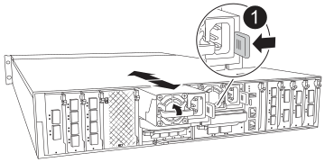

Replacing a power supply (PSU) involves disconnecting the target PSU from the power source, unplugging the power cable, removing the old PSU and installing the replacement PSU, and then reconnecting it to the power source.

The power supplies are redundant and hot-swappable.

.About this task
This procedure is written for replacing one PSU at a time.

IMPORTANT: Do not mix PSUs with different efficiency ratings. Always replace like for like.

.Steps

. If you are not already grounded, properly ground yourself.
. Identify the PSU you want to replace, based on console error messages or through the red Fault LED on the PSU.
. Disconnect the PSU by opening the power cable retainer, and then unplug the power cable from the PSU.
. Remove the PSU by rotating the handle up, press the locking tab, and then pull PSU out of the controller module.
+
CAUTION: The PSU is short. Always use two hands to support it when removing it from the controller module so that it does not suddenly swing free from the controller module and injure you.
+

+
[cols="1,4"]
|===
a|
image:../media/legend_icon_01.svg[Callout number 1, width=30px] 
a|
Terracotta PSU locking tab
|===

. Install the replacement PSU in the controller module:
.. Using both hands, support and align the edges of the replacement PSU with the opening in the controller module.
.. Gently push the PSU into the controller module until the locking tab clicks into place.
+
The power supplies will only properly engage with the internal connector and lock in place one way.
+
NOTE: To avoid damaging the internal connector, do not use excessive force when sliding the PSU into the system.

. Reconnect the PSU cabling:
.. Reconnect the power cable to the PSU.
.. Secure the power cable to the PSU using the power cable retainer.

+
Once power is restored to the PSU, the status LED should be green.
include::../_include/complete_rma_step.adoc[]
