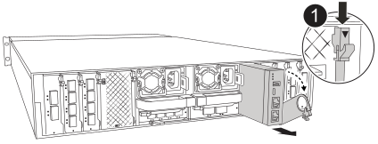

The System Management module, located at the back of the controller in slot 8,  contains onboard components for system management, as well as ports for external management. The target controller must be shut down to replace an impaired System Management module or replace the boot media.

The System Management module has the following onboard components:

** Boot media, allowing boot media replacement without removing the controller module.
** BMC
** Management switch

The System Management module also contains the following ports for external management:

** RJ45 Serial
** USB Serial (Type-C)
** USB Type-A (Boot recovery)
** e0M RJ45 Ethernet

To replace the System Management module or or the boot media, you must shut down the impaired controller.  

.Before you begin
* This procedure uses the following terminology:
 ** The impaired controller is the controller on which you are performing maintenance.
 ** The healthy controller is the HA partner of the impaired controller.
 * All other system components must be working properly.
* The partner controller must be able to take over the impaired controller.
* You must replace the failed component with a replacement FRU component you received from your provider.

== Step 1: Shut down the impaired controller

Shut down or take over the impaired controller using one of the following options.

[role="tabbed-block"]
====

.Option 1: Most systems
--
include::../_include/shutdown_most_frus.adoc[]
--
.Option 2: Controller is in a MetroCluster
--
include::../_include/shutdown_any_mcc_no_2-node_mcc.adoc[]
--

====

== Step 2: Replace the impaired System Management module

Replace the impaired system management module.

. Remove the System Management module:
+
NOTE:  Make sure NVRAM destage has completed before proceeding.
+

+
[cols="1,4"]
|===
a|
image::../media/icon_round_1.png[Callout number 1,width=30px]
a|
System Management module cam latch
|===

.. If you are not already grounded, properly ground yourself.  
+
NOTE:  Make sure NVRAM destage has completed before proceeding.
+
.. Remove any cables connected to the System Management module. Make sure that label where the cables were connected, so that you can connect them to the correct ports when you reinstall the module. 
.. Disconnect the power cords from the PSU for the impaired controller.

.. Rotate the cable management tray down by pulling the buttons on both sides on the inside of the cable management tray and then rotate the tray down.

.. Depress the cam button on the System Management module.

.. Rotate the cam lever down as far as it will go.
 .. Loop your finger into the hole on the cam lever and pull the module straight out of the system.
.. Place the System Management module on an anti-static mat, so that the boot media is accessible.
. Move the boot media to the replacement System Management module:
+
image::../media/drw_a1k_boot_media_remove_replace_ieops-1377.svg[Boot media replace]
+
[cols="1,4"]
|===
a|
image::../media/icon_round_1.png[Callout number 1,width=30px]
a|
System Management module cam latch
a|
image::../media/icon_round_2.png[Callout number 2]
a|
Boot media locking button
a|
image::../media/icon_round_3.png[Callout number 3]
a|
Boot media
|===

.. Press the blue boot media locking button in the impaired System Management module.

.. Rotate the boot media up and slide it out of the socket.

. Install the boot media in the replacement System Management module:
.. Align the edges of the boot media with the socket housing, and then gently push it squarely into the socket.
.. Rotate the boot media down until it touches the locking button. 
.. Depress the blue locking  and rotate the boot media all the way down and release the blue locking button.
. Install the replacement System Management module into the enclosure:
.. Align the edges of the replacement System Management module with the system opening and gently push it into the controller module.  
.. Gently slide the module into the slot until the cam latch begins to engage with the I/O cam pin, and then rotate the cam latch all the way up to lock the module in place.

. Rotate the cable management arm up to the closed position.
. Recable the System Management module.

== Step 3: Reboot the controller module

Reboot the controller module.

. Plug the power cables back into the PSU. 
+
The system will begin to reboot, typically to the LOADER prompt.
+
. Enter _bye_ at the LOADER prompt.
. Return the controller to normal operation by giving back its storage: _storage failover giveback -ofnode _impaired_node_name__
. Restore automatic giveback by using the `storage failover modify -node local -auto-giveback true` command.
. If an AutoSupport maintenance window was triggered, end it by using the `system node autosupport invoke -node * -type all -message MAINT=END` command.

== Step 4: Install licenses and register serial number

include::../_include/install_licenses_serial_number-system_mgmt_module.adoc[]

== Step 5: Return the failed part to NetApp

include::../_include/complete_rma.adoc[]

