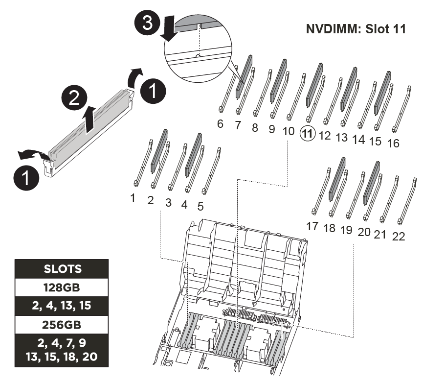

You need to locate the DIMMs, and then move them from the impaired controller module to the replacement controller module.

You must have the new controller module ready so that you can move the DIMMs directly from the impaired controller module to the corresponding slots in the replacement controller module.

You can use the following animation, illustration, or the written steps to move the DIMMs from the impaired controller module to the replacement controller module.

video::717b52fa-f236-4f3d-b07d-aad9012f51a3[panopto, title="Animation - Move the DIMMs"]

 

[cols="10,90"]
|===
a|
image:../media/icon_round_1.png[Callout number 1] 
a|
DIMM locking tabs
a|
image:../media/icon_round_2.png[Callout number 2]
a|
DIMM
a|
image:../media/icon_round_3.png[Callout number 3]
a|
DIMM socket
|===

. Locate the DIMMs on your controller module.
. Note the orientation of the DIMM in the socket so that you can insert the DIMM in the replacement controller module in the proper orientation.
. Verify that the NVDIMM battery is not plugged into the new controller module.
. Move the DIMMs from the impaired controller module to the replacement controller module:
+
NOTE: Make sure that you install the each DIMM into the same slot it occupied in the impaired controller module.

 .. Eject the DIMM from its slot by slowly pushing apart the DIMM ejector tabs on either side of the DIMM, and then slide the DIMM out of the slot.
+
NOTE: Carefully hold the DIMM by the edges to avoid pressure on the components on the DIMM circuit board.

 .. Locate the corresponding DIMM slot on the replacement controller module.
 .. Make sure that the DIMM ejector tabs on the DIMM socket are in the open position, and then insert the DIMM squarely into the socket.
+
The DIMMs fit tightly in the socket, but should go in easily. If not, realign the DIMM with the socket and reinsert it.

 .. Visually inspect the DIMM to verify that it is evenly aligned and fully inserted into the socket.
 .. Repeat these substeps for the remaining DIMMs.

. Plug the NVDIMM battery into the motherboard.
+
Make sure that the plug locks down onto the controller module.