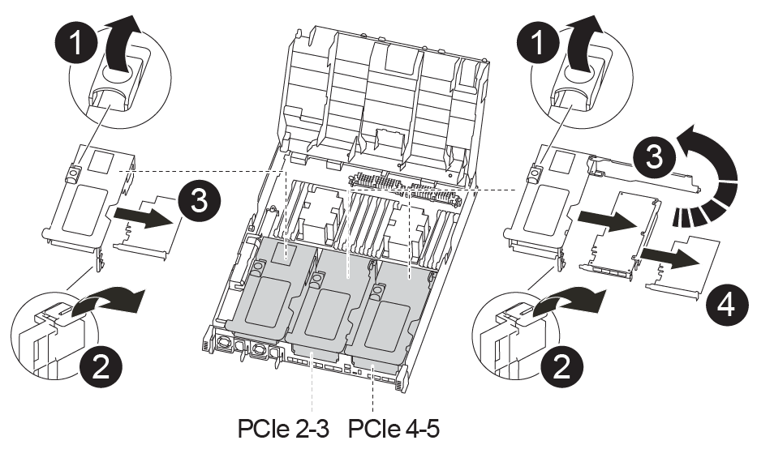

As part of the controller replacement process, you must move the PCIe risers and mezzanine card from the impaired controller module to the replacement controller module.

You can use the following animations, illustrations, or the written steps to move the PCIe risers and mezzanine card from the impaired controller module to the replacement controller module.

Moving PCIe riser 1 and 2 (left and middle risers):

video::f4ee1d4d-6029-4fe6-a063-aad9012f170b[panopto, title="Animation - Move PCI risers 1 and 2"]

Moving the mezzanine card and riser 3 (right riser):

video::b0c3b575-3434-4e00-a421-aad9012f2e9e[panopto, title="Animation - Move the mezzanine card and riser 3"]

[cols="10,90"]
|===
a|
image:../media/icon_round_1.png[Callout number 1] 
a|
Riser locking latch
a|
image:../media/icon_round_2.png[Callout number 2]
a|
PCI card locking latch
a|
image:../media/icon_round_3.png[Callout number 3]
a|
PCI locking plate
a|
image:../media/icon_round_4.png[Callout number 4]
a|
PCI card
|===

. Move PCIe risers one and two from the impaired controller module to the replacement controller module:
 .. Remove any SFP or QSFP modules that might be in the PCIe cards.
 .. Rotate the riser locking latch on the left side of the riser up and toward air duct.
+
The riser raises up slightly from the controller module.

 .. Lift the riser up, and then move it to the replacement controller module.
 .. Align the riser with the pins to the side of the riser socket, lower the riser down on the pins, push the riser squarely into the socket on the motherboard, and then rotate the latch down flush with the sheet metal on the riser.
 .. Repeat this step for riser number 2.
. Remove riser number 3, remove the mezzanine card, and install both into the replacement controller module:
 .. Remove any SFP or QSFP modules that might be in the PCIe cards.
 .. Rotate the riser locking latch on the left side of the riser up and toward air duct.
+
The riser raises up slightly from the controller module.

 .. Lift the riser up, and then set it aside on a stable, flat surface.
 .. Loosen the thumbscrews on the mezzanine card, and gently lift the card directly out of the socket, and then move it to the replacement controller module.
 .. Install the mezzanine in the replacement controller and secure it with the thumbscrews.
 .. Install the third riser in the replacement controller module.