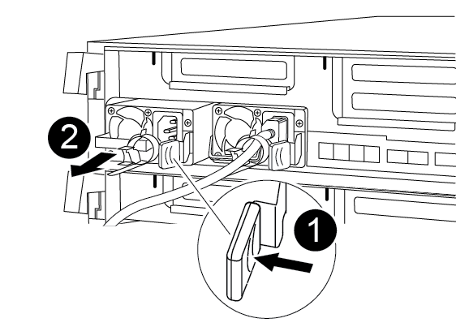

You must move the power supply from the impaired controller module to the replacement controller module when you replace a controller module.

You can use the following animation, illustration, or the written steps to move the power supplies to the replacement controller module.

video::92060115-1967-475b-b517-aad9012f130c[panopto, title="Animation - Move the power supplies"]

. Remove the power supply:
+

+
[cols="10,90"]
|===
a|
image:../media/icon_round_1.png[Callout number 1] 
a|
PSU locking tab
a|
image:../media/icon_round_2.png[Callout number 2]
a|
Power cable retainer
|===

.. Rotate the cam handle so that it can be used to pull the power supply out of the chassis.
.. Press the blue locking tab to release the power supply from the chassis.
.. Using both hands, pull the power supply out of the chassis, and then set it aside.
. Move the power supply to the new controller module, and then install it.
. Using both hands, support and align the edges of the power supply with the opening in the controller module, and then gently push the power supply into the controller module until the locking tab clicks into place.
+
The power supplies will only properly engage with the internal connector and lock in place one way.
+
NOTE: To avoid damaging the internal connector, do not use excessive force when sliding the power supply into the system.

. Repeat the preceding steps for any remaining power supplies.