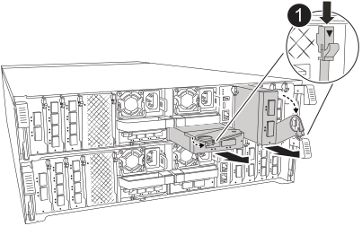

You can add an I/O module to your storage system by either adding a new I/O module into a storage system with empty slots or by replacing an I/O module with a new one in a fully-populated storage system.

.Before you begin

* Check the https://hwu.netapp.com/[NetApp Hardware Universe^] to make sure that the new I/O module is compatible with your storage system and version of ONTAP you're running.

* If multiple slots are available, check the slot priorities in https://hwu.netapp.com/[NetApp Hardware Universe^]  and use the best one available for your I/O module.

* Make sure that all other components are functioning properly.

== Option 1: Add an I/O module to a storage system with empty slots

You can add an I/O module into an empty module slot in your storage system.

=== Step 1: Shut down the impaired controller module

Shut down or take over the impaired controller module using one of the following options.

[role="tabbed-block"]
====

.Option 1: Most systems
--
include::../_include/shutdown_most_frus_no_PCM_remove.adoc[]
--
.Option 2: Controller is in a MetroCluster
--
include::../_include/shutdown_any_mcc_supported_no_PCM_remove.adoc[]
--

====

=== Step 2: Add I/O modules

. If you are not already grounded, properly ground yourself. 

. Rotate the cable management tray down by pulling the buttons on both sides on the inside of the cable management tray and then rotate the tray down.
. Remove the target slot blanking module from the chassis:

+
NOTE: The following illustration shows removing a horizontal and vertical I/O module. Typically, you will only remove one I/O module.
+

+
[cols="1,4"]
|===
a|
image:../media/icon_round_1.png[Callout number 1]
a|
Cam locking button

|===

 .. Depress the cam latch on the blanking module in the target slot.
 .. Rotate the cam latch away from the module as far as it will go.
 .. Remove the blanking module.
. Install the I/O module:
 .. Align the I/O module with the edges of the controller module slot opening.
 .. Gently slide the module all the way into the into the slot, and then rotate the cam latch all the way up to lock the module in place.
. Cable the I/O module to the designated device.

+
NOTE: Make sure that any unused I/O slots have blanks installed to prevent possible thermal issues.

. Rotate the cable management tray up to the closed position.
. Reboot the controller from the LOADER prompt: _bye_
+
NOTE: This reinitializes the PCIe cards and other components and reboots the node.
+
. Give back the controller from the partner controller: _storage failover giveback -ofnode target_node_name_
. Repeat these steps for controller B.

. From the healthy node, restore automatic giveback if you disabled it by using the `storage failover modify -node local -auto-giveback true` command.

. If AutoSupport is enabled, restore/unsuppress automatic case creation by using the `system node autosupport invoke -node * -type all -message MAINT=END` command.

== Option 2: Add an I/O module in a storage system with no empty slots

You can change an I/O module in an I/O slot in a fully-populated system by removing an existing I/O module and replacing it with a different I/O module.

. If you are:
+
[options="header" cols="1,2"]

|===
| Replacing a...| Then...
a|
NIC I/O module with the same the same number of ports
a|
The LIFs will automatically migrate when its controller module is shut down.
a|
NIC I/O module with fewer ports
a|
Permanently reassign the affected LIFs to a different home port. See https://docs.netapp.com/ontap-9/topic/com.netapp.doc.onc-sm-help-960/GUID-208BB0B8-3F84-466D-9F4F-6E1542A2BE7D.html[Migrating a LIF^] for information about using System Manager to permanently move the LIFs.
a|
NIC I/O module with a storage I/O module
a|
Use System Manager to permanently migrate the LIFs to different home ports, as described in https://docs.netapp.com/ontap-9/topic/com.netapp.doc.onc-sm-help-960/GUID-208BB0B8-3F84-466D-9F4F-6E1542A2BE7D.html[Migrating a LIF^].
|===

=== Step 1: Shut down the impaired controller module

Shut down or take over the impaired controller module using one of the following options.

[role="tabbed-block"]
====

.Option 1: Most systems
--
include::../_include/shutdown_most_frus_no_PCM_remove.adoc[]
--
.Option 2: Controller is in a MetroCluster
--
include::../_include/shutdown_any_mcc_supported_no_PCM_remove.adoc[]
--

====

=== Step 2: Replace an I/O module
To replace an I/O module, locate it within the controller module and follow the specific sequence of steps.

. If you are not already grounded, properly ground yourself. 

. Unplug any cabling on the target I/O module.
. Rotate the cable management tray down by pulling the buttons on the inside of the cable management tray and rotating it down.
. Remove the target I/O module from the chassis:

+
NOTE: The following illustration shows removing a horizontal and vertical I/O module. Typically, you will only remove one I/O module.
+

+
[cols="1,4"]
|===
a|
image:../media/icon_round_1.png[Callout number 1]|
Cam locking button

|===

.. Depress the cam latch button.
+
The cam latch moves away from the chassis.
.. Rotate the cam latch down as far as it will go. For horizontal modules, rotate the cam away from the module as far as it will go.
.. Remove the module from the chassis by hooking your finger into the cam lever opening and pulling the module out of the chassis.
+
Make sure that you keep track of which slot the I/O module was in.
+
. Install the I/O module into the target slot:
.. Align the I/O module with the edges of the slot.
.. Gently slide the module into the slot all the way into the chassis, and then rotate the cam latch all the way up to lock the module in place.
. Cable the I/O module to the designated device.

. Repeat the remove and install steps to replace additional modules for the controller module.

. Rotate the cable management tray into the locked position.
. Reboot the controller module from the LOADER prompt:_bye_
.. Check the version of BMC on the controller: _system service-processor show_
.. Update the BMC firmware if needed: _system service-processor image update_
.. Reboot the node: _bye_
+
NOTE: This reinitializes the PCIe cards and other components and reboots the node.
+

NOTE: If you encounter an issue during reboot, see https://mysupport.netapp.com/site/bugs-online/product/ONTAP/BURT/1494308[BURT 1494308 - Environment shutdown might be triggered during I/O module replacement]

. Give back the controller module from the partner controller module. _storage failover giveback -ofnode target_node_name_
. Enable automatic giveback if it was disabled: _storage failover modify -node local -auto-giveback true_

. If you added:
+
[options="header" cols="1,2"]
|===
| If I/O module is a...| Then...
a|
NIC module
a|
Use the `storage port modify -node *_<node name>__ -port *_<port name>__ -mode network` command for each port.
a|
Storage module
a|
Install and cable your NS224 shelves, as described in
link:../ns224/hot-add-shelf-overview.html[Hot-add workflow].
|===

. Repeat these steps for controller B.