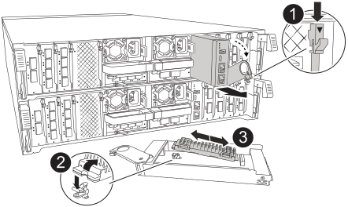

Replace the boot media, which is located inside the System Management module at the rear of the controller.

.Before you begin

* You must have a replacement boot media.
* Have an anti-static mat available for the System Management module.

.Steps

. Verify that NVRAM destage has completed before proceeding. When the LED on the NV module is off, NVRAM is destaged. 
+
If the LED is flashing, wait for the flashing to stop. If flashing continues for longer than 5 minutes, contact NetApp Support for assistance.
+
image::../media/drw_a1K-70-90_nvram-led_ieops-1463.svg[NVRAM attention and status LED location graphic]
+
[cols="1,4"]
|===
a|
image:../media/icon_round_1.png[Callout number 1] 
a|
NVRAM status LED
a|
image:../media/icon_round_2.png[Callout number 2] 
a|
NVRAM attention LED
|===

. Go to the rear of the chassis and properly ground yourself if you are not already grounded.

. Disconnect power from the controller:
+
* For AC power supplies, disconnect the power cords from the power supplies.
* For DC power supplies, disconnect the power block from the power supplies.

. Remove the System Management module:
+
.. Remove any cables connected to the System Management module. Label the cables to identify their correct ports for reinstallation.
.. Rotate the cable management arm down by pulling the buttons on both sides of the cable management arm.
.. Depress the system management cam button.
+
The cam lever moves away from the chassis.
+
.. Rotate the cam lever all the way down and remove the System Management module from the controller.
.. Place the System Management module on an anti-static mat with the boot media accessible.

. Remove the boot media from the System Management module:
+

+
[cols="1,4"]
|===
a|
image::../media/icon_round_1.png[Callout number 1] 
a|
System Management module cam latch
a|
image::../media/icon_round_2.png[Callout number 2]
a|
Boot media locking button
a|
image::../media/icon_round_3.png[Callout number 3]
a|
Boot media
|===
+
.. Press the blue locking button.
.. Rotate the boot media up, slide it out of the socket, and set it aside.

. Install the replacement boot media into the System Management module:
+
.. Align the edges of the boot media with the socket housing, and then gently push it squarely into the socket.
.. Rotate the boot media down toward the locking button. 
.. Push the locking button, rotate the boot media all the way down, and then release the locking button.

. Reinstall the System Management module:
+
.. Align the edges of the System Management module with the chassis opening.
.. Gently slide the module into the chassis until the cam latch begins to engage.
.. Rotate the cam latch all the way up to lock the module in place.
.. Reconnect the cables to the System Management module using the labels you created during removal.
.. Rotate the cable management arm up to the closed position.

. Reconnect power to the controller:
+
* For AC power supplies, plug the power cords into the power supplies.
* For DC power supplies, reconnect the power block to the power supplies.
+
The controller automatically reboots when power is restored.

. Interrupt the boot process by pressing `Ctrl-C` to stop at the LOADER prompt.

// ontap-systems-internal/issues/1151//2025-11-25 ontap-systems-internal/1315 and ontap-systems-internal/1380
