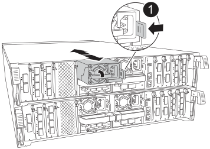

.Steps
. Remove the four PSUs:

.. If you are not already grounded, properly ground yourself.
.. Unplug power cords from the controller module PSU.

+
If your system has DC power, disconnect the power block from the PSUs. 

.. Remove the PSU from the controller by rotating the PSU handle up so that you can pull the PSU out, press the PSU locking tab, and then pull PSU out of the controller module.
+
CAUTION: The PSU is short. Always use two hands to support it when removing it from the controller module so that it does not suddenly swing free from the controller module and injure you.

+

+
[cols="1,4"]
|===
a|image:../media/icon_round_1.png[Callout number 1] 
a|
Terracotta PSU locking tab
|===

+
.. Repeat these steps for the remaining PSUs. 

. Remove the cables:

.. Unplug the system cables and any  SFP and QSFP modules (if needed) from the controller module, but leave them in the cable management device to keep them organized.

+
NOTE: Cables should have been labeled at the beginning of this procedure.

+
.. Remove the cable management device from the controller modules and set them aside. 
