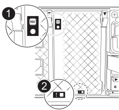

// Remove the controller module - AFF A70 and AFF A90 (integrated)

You must remove the controller module from the chassis when you replace the controller module or replace a component inside the controller module.

. Check the amber NVRAM LED located on the back of the controller module. Look for the NV icon:
+

+
[cols="1,4"]
|===
a|
image:../media/legend_icon_01.svg[Callout number 1, width=30px] 
a|
NVRAM status LED
a|
image:../media/legend_icon_02.svg[Callout number 1, width=30px] 
a|
NVRAM attention LED
|===

+
NOTE: The amber NV LED on the faceplate will start flashing when power is removed from the controller if the system was in the "waiting for giveback" state, or the system was not taken over or halted properly (uncommitted data).  If the impaired controller module was not successfully taken over by the partner controller module, contact https://mysupport.netapp.com/site/global/dashboard[NetApp Support]

+

* If the amber NV status LED begins flashing when the controller module is removed from the chassis:
** Confirm that the controller had a clean takeover by the partner controller module or the impaired controller shows _waiting for giveback_, the flashing LED can be ignored and you can complete removing the impaired controller from the chassis.
* If the amber NV LED if off, you can complete removing the impaired controller from the chassis.
. If you are not already grounded, properly ground yourself.
. Unplug the controller module power supply cables from the controller module power supplies.

+
NOTE: If your system has DC power, disconnect the power block from the PSU. 
+

. Unplug the system cables and SFP and QSFP modules (if needed) from the controller module, keeping track of where the cables were connected.
+
Leave the cables in the cable management device so that when you reinstall the cable management device, the cables are organized.

. Remove the cable management device from the controller module. 
. Press down on both of the locking latches, and then rotate both latches downward at the same time.
+
The controller module moves slightly out of the chassis.
+
image::../media/drw_a70-90_pcm_remove_replace_ieops-1365.svg[Controller remove graphic]
+
[cols="1,4"]
|===
a|
image:../media/legend_icon_01.svg[Callout number 1, width=30px]|
Locking latch
a|
image:../media/legend_icon_02.svg[Callout number 2, width=30px]
a|
Locking pin
|===

. Slide the controller module out of the chassis and place it on a flat, stable surface.
+
Make sure that you support the bottom of the controller module as you slide it out of the chassis.
