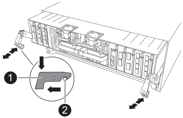

// Remove the controller module - AFF A70 and AFF A90 (integrated)

.Steps

. If you are not already grounded, properly ground yourself.

. Ensure that all drives in the chassis are firmly seated against the midplane by using your thumbs to push each drive until you feel a positive stop.
+
video::2c46e4af-2c21-4f12-b065-b38b003d0ea2[panopto, title="Video - Confirm drive seating"]
+
image::../media/drw_a800_drive_seated_IEOPS-960.svg[Seat the drives]
+
. Check the controller drives based on the system status:

.. On the healthy controller, check if any active RAID group is in a degraded state, failed state, or both:

+
[source,cli]
----
storage aggregate show -raidstatus !*normal*
----
+ 
- If the command returns `There are no entries matching your query.` continue to <<Check-missing-drives, go to the next sub-step to check for missing drives>>. 
- If the command returns any other results, collect the AutoSupport data from both controllers and contact NetApp Support for further assistance.
+
[source,cli]
----
system node autosupport invoke -node * -type all -message '<message_name>'
----

+
.. [[Check-missing-drives]]Check for missing drive issues for both the file system or spare drives:

+
[source,cli]
----
event log show -severity * -node * -message-name *disk.missing*
----

+ 
- If the command returns `There are no entries matching your query.` continue to <<remove-power-cables, go to the next step>>. 
- If the command returns any other results, collect the AutoSupport data from both controllers and contact NetApp Support for further assistance.
+
[source,cli]
----
system node autosupport invoke -node * -type all -message '<message_name>'
----

. Check the amber NVRAM that status LED located in slot 4/5 on the back of the impaired controller module is off. Look for the NV icon.
+
image::../media/drw_a1K-70-90_nvram-led_ieops-1463.svg[NVRAM attention and status LED location graphic]
+

[cols="1,4"]

|===
a|
image:../media/icon_round_1.png[Callout number 1] 
a|
NVRAM status LED
a|
image:../media/icon_round_2.png[Callout number 2] 
a|
NVRAM attention LED
|===

* If the NV LED is off, go to the next step.
* If the NV LED is flashing, wait for the flashing to stop. If flashing continues for longer than 5 minutes, contact Technical Support for assistance.

. If you are not already grounded, properly ground yourself.
. Unplug the controller module power supply cables from the controller module power supplies (PSU).

+
NOTE: If your system has DC power, disconnect the power block from the PSUs. 
+

. Unplug the system cables and SFP and QSFP modules (if needed) from the controller module, keeping track of where the cables were connected.
+
Leave the cables in the cable management device so that when you reinstall the cable management device, the cables are organized.

. Remove the cable management device from the controller module. 
. Press down on both of the locking latches, and then rotate both latches downward at the same time.
+
The controller module moves slightly out of the chassis.
+

+
[cols="1,4"]
|===
a|
image:../media/icon_round_1.png[Callout number 1] 
a|
Locking latch
a|
image:../media/icon_round_2.png[Callout number 2] 
a|
Locking pin
|===

. Slide the controller module out of the chassis and place it on a flat, stable surface.
+
Make sure that you support the bottom of the controller module as you slide it out of the chassis.

//2025-11-25 ontap-systems-internal/1315 and ontap-systems-internal/1380
