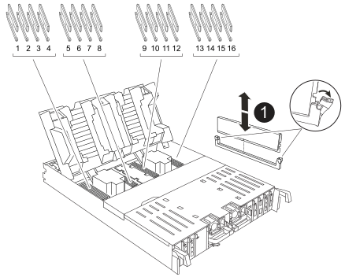

.Steps
. Open the controller air duct on the top of the controller.
.. Insert your fingers in the recesses at the far ends of the air duct.
.. Lift the air duct and rotate it upward as far as it will go.
. Locate the system DIMMs on the motherboard, using the DIMM map on top of the air duct.
+
The DIMM locations, by model, are listed in the following table:

+
[cols="1,4"]

|===

|Model|DIMM slot location

a|
FAS70 |3, 10, 19, 26
a|
FAS90 |3, 7, 10, 14, 19, 23, 26, 30  

|===

+

+
[cols="1,4"]

|===
a|
image::../media/icon_round_1.png[Callout number 1]
|
System DIMM
|===

. Note the orientation of the DIMM in the socket so that you can insert the DIMM in the replacement controller module in the proper orientation.
. Eject the DIMM from its slot by slowly pushing apart the two DIMM ejector tabs on either side of the DIMM, and then slide the DIMM out of the slot.
+
NOTE: Carefully hold the DIMM by the edges to avoid pressure on the components on the DIMM circuit board.

. Locate the slot on the replacement controller module where you are installing the DIMM.
. Insert the DIMM squarely into the slot.
+
The DIMM fits tightly in the slot, but should go in easily. If not, realign the DIMM with the slot and reinsert it.
+
NOTE: Visually inspect the DIMM to verify that it is evenly aligned and fully inserted into the slot.

. Push carefully, but firmly, on the top edge of the DIMM until the ejector tabs snap into place over the notches at the ends of the DIMM.
. Repeat these steps for the remaining DIMMs.
. Close the controller air duct.
