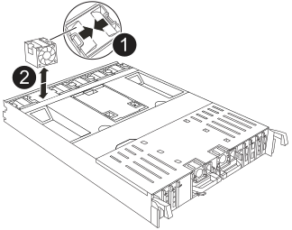

.Steps
. Remove the fan module by pinching the locking tabs on the side of the fan module, and then lifting the fan module straight out of the controller module.
+

+
[cols="1,4"]

|===
a|
image::../media/icon_round_1.png[Callout number 1]
a|
Fan locking tabs
a|
image::../media/icon_round_2.png[Callout number 2]
a|
Fan module
|===

. Move the fan module to the replacement controller module, and then install it by aligning its edges with the opening in the controller module and sliding it in until the locking latches click into place.
. Repeat these steps for the remaining fan modules.

//2025-11-25 ontap-systems-internal/1315 and ontap-systems-internal/1380
