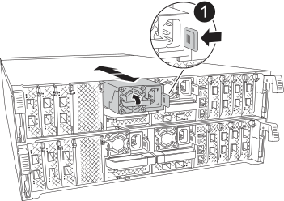
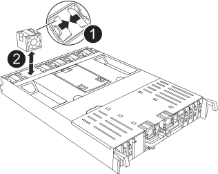
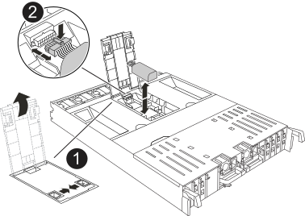
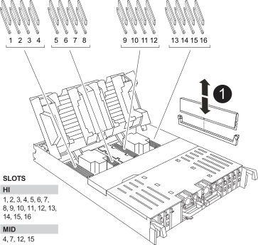
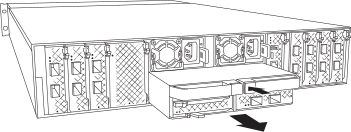

To replace the controller, you must remove the impaired controller, move FRU components from the impaired controller module to the replacement controller module, install the replacement controller module in the chassis, and then boot the system to Maintenance mode.

== Step 1: Remove the controller module

include::../_include/a70-90_controller_remove_physical.adoc[]

== Step 2: Move the power supplies

Move the power supplies to the replacement controller.

. Rotate the cam handle such that it can be used to pull power supply out of the controller module while pressing the locking tab.
+
CAUTION: The power supply is short. Always use two hands to support it when removing it from the controller module so that it does not suddenly swing free from the controller module and injure you.
+

+
[cols="1,4"]
|===
a|
image::../media/legend_icon_01.svg[Callout number 1,width=30px]
|
Blue power supply locking tab
a|
image::../media/legend_icon_02.svg[Callout number 2,width=30px]
a|
Power supply
|===

. Move the power supply to the new controller module, and then install it.
. Using both hands, support and align the edges of the power supply with the opening in the controller module, and then gently push the power supply into the controller module until the locking tab clicks into place.
+
The power supplies will only properly engage with the internal connector and lock in place one way.
+
NOTE: To avoid damaging the internal connector, do not use excessive force when sliding the power supply into the system.

== Step 3: Move the fans

Move the fans to the replacement controller module.

. Remove the fan module by pinching the locking tabs on the side of the fan module, and then lifting the fan module straight out of the controller module.
+

+
[cols="1,4"]
|===
a|
image::../media/legend_icon_01.svg[Callout number 1,width=30px]
a|
Fan locking tabs
a|
image::../media/legend_icon_02.svg[Callout number 2,width=30px]
a|
Fan module
|===

. Move the fan module to the replacement controller module, and then install the fan module by aligning its edges with the opening in the controller module, and then sliding the fan module into the controller module until the locking latches click into place.
. Repeat these steps for the remaining fan modules.

== Step 4: Move the BBU battery

Move the battery backup unit to the replacement controller module.

. Open the air duct cover in the middle of the controller module and locate the BBU battery.
+

+
[cols="1,4"]
|===
a|
image::../media/legend_icon_01.svg[Callout number 1,width=30px]
|
BBU air duct
a|
image::../media/legend_icon_02.svg[Callout number 2,width=30px]
a|
BBU battery pack plug
|===

*Attention:* The BBU battery control board LED blinks while destaging contents to the flash memory when you halt the system. After the destage is complete, the LED turns off.

. Locate the battery plug and squeeze the clip on the face of the battery plug to release the plug from the socket, and then unplug the battery cable from the socket.
. Grasp the battery and lift the battery out of the air duct and controller module.
. Move the battery pack to the replacement controller module and then install it in the replacement controller module:
.. Open the BBU battery air duct in the replacement controller module.
 .. Plug the battery plug into the riser socket and make sure that the plug locks into place.
 .. Insert the battery pack into the slot and press firmly down on the battery pack to make sure that it is locked into place.
 .. Close the BBU air duct.
 
== Step 5: Move system DIMMs

Move the DIMMs to the replacement controller module.

. Open the motherboard air duct by pinching the tabs in the middle of the air duct and rotating it upward.
. Locate the system DIMMs on the motherboard.
+

+
[cols="1,4"]
|===
a|
image::../media/legend_icon_01.svg[Callout number 1,width=30px]
|
System DIMM
|===

. Note the orientation of the DIMM in the socket so that you can insert the DIMM in the replacement controller module in the proper orientation.
. Eject the DIMM from its slot by slowly pushing apart the two DIMM ejector tabs on either side of the DIMM, and then slide the DIMM out of the slot.
+
NOTE: Carefully hold the DIMM by the edges to avoid pressure on the components on the DIMM circuit board.

. Locate the slot where you are installing the DIMM.
. Insert the DIMM squarely into the slot.
+
The DIMM fits tightly in the slot, but should go in easily. If not, realign the DIMM with the slot and reinsert it.
+
NOTE: Visually inspect the DIMM to verify that it is evenly aligned and fully inserted into the slot.

. Push carefully, but firmly, on the top edge of the DIMM until the ejector tabs snap into place over the notches at the ends of the DIMM.
. Repeat these steps for the remaining DIMMs.
. Close the motherboard air duct.

== Step 6: Move the I/O modules

Move the I/O modules to the replacement controller module.

. Remove the PCIe riser from the controller module:
 .. Remove any SFP or QSFP modules that might be in the PCIe cards.
 .. Rotate the riser locking latch on the left side of the riser up and toward the fan modules.
+
The riser raises up slightly from the controller module.

 .. Lift the riser up, shift it toward the fans so that the sheet metal lip on the riser clears the edge of the controller module, lift the riser out of the controller module, and then place it on a stable, flat surface.
+

+
[cols="1,4"]
|===
a|
image::../media/legend_icon_01.svg[Callout number 1,width=30px]
|
Air duct
a|
image::../media/legend_icon_02.svg[Callout number 2,width=30px]
a|
Riser 1 (left riser), Riser 2 (middle riser), and 3 (right riser) locking latches
|===
. Repeat the preceding step for the remaining risers in the impaired controller module.
. Repeat the above steps with the empty risers in the replacement controller and put them away.

== Step 10: Install the controller module

include::../_include/a70-90_controller_install_step_physical.adoc[]
. Plug the power cables into the power supplies and reinstall the power cable retainers.
+
NOTE: If your system has DC power supplies, make sure the thumbscrews on the power supply cable are tight.
