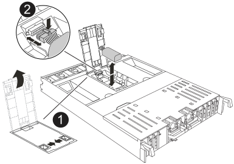

.Steps
. Open the air duct cover in the middle of the controller module and locate the NV battery.
+

+
[cols="1,4"]

|===
a|
image::../media/icon_round_1.png[Callout number 1]
|
NV battery air duct
a|
image::../media/icon_round_2.png[Callout number 2]
a|
NV battery pack plug
|===

+

*Attention:* The NV module LED blinks while destaging contents to the flash memory when you halt the system. After the destage is complete, the LED turns off.

. Lift the battery up to access the battery plug.
. Squeeze the clip on the face of the battery plug to release the plug from the socket, and then unplug the battery cable from the socket.
. Lift the battery out of the air duct and controller module.
. Move the battery pack to the replacement controller module and then install it in the replacement controller module:
.. Open the NV battery air duct in the replacement controller module.
 .. Plug the battery plug into the socket and make sure that the plug locks into place.
 .. Insert the battery pack into the slot and press firmly down on the battery pack to make sure that it is locked into place.
 .. Close the NV battery air duct.
