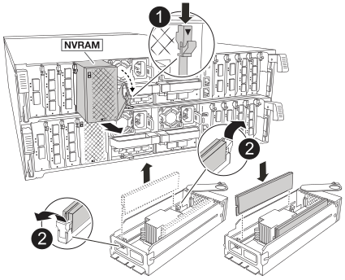

.Steps
. Remove the NVRAM module from the impaired controller module:
+

+
[cols="1,4"]
|===
a|image:../media/icon_round_1.png[Callout number 1] 
a|
Cam locking button
a|
image:../media/icon_round_2.png[Callout number 2] 
a|
DIMM locking tab
|===
+
.. Depress the cam latch button.
+
The cam button moves away from the chassis.

 .. Rotate the cam latch as far as it will go.
+
.. Remove the NVRAM module from the enclosure by hooking your finger into the cam lever opening and pulling the module out of the enclosure.

. Install the NVRAM module into slot 4/5 in the replacement controller module:

 .. Align the module with the edges of the chassis opening in slot 4/5.
 .. Gently slide the module into the slot all the way, and then push the cam latch all the way up to lock the module in place.
