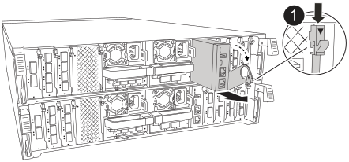

.Steps
. Remove the System Management module from the impaired controller module:
+

+
[cols="1,4"]
|===
a|
image::../media/icon_round_1.png[Callout number 1]
a|
System Management module cam latch

|===
+
.. Depress the system management cam button.
.. Rotate the cam lever all the way down.
 .. Loop your finger into the cam lever and pull the module straight out of the system.

 . Install the system management module into the replacement controller module in the same slot that it was in on the impaired controller module:
.. Align the edges of the System Management module with the system opening and gently push it into the controller module.  
.. Gently slide the module into the slot until the cam latch begins to engage with the I/O cam pin, and then rotate the cam latch all the way up to lock the module in place.

//2025-11-25 ontap-systems-internal/1315 and ontap-systems-internal/1380
