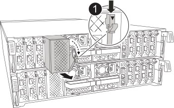

You must replace the NVDIMM in the controller module when your system registers that the flash lifetime is almost at an end or that the identified NVDIMM is not healthy in general; failure to do so causes a system panic.

All other components in the system must be functioning properly; if not, you must contact technical support.

You must replace the failed component with a replacement FRU component you received from your provider.

== Step 1: Shut down the impaired controller

include::../_include/shutdown_most_frus.adoc[]

== Step 2: Replace the NVDIMM

To replace the NVDIMM, *you must locate it in the controller module using the NVDIMM map label on top of the air duct #does this still apply?#,* and then replace it following the specific sequence of steps.

. If you are removing an NVDIMM, unlock the locking latch on the module, and then remove the applicable module.
+

+
[cols="1,4"]
|===
a|
image:../media/legend_icon_01.png[Callout number 1]|
Module latch
a|
image:../media/legend_icon_02.png[Callout number 2]
a|
NVDIMM and ejector tab
|===

. Note the orientation of the NVDIMM in the socket so that you can insert the NVDIMM in the replacement controller module in the proper orientation.
. Eject the NVDIMM from its slot by slowly pushing apart the two NVDIMM ejector tabs on either side of the NVDIMM, and then slide the NVDIMM out of the socket and set it aside.
+
NOTE: Carefully hold the NVDIMM by the edges to avoid pressure on the components on the NVDIMM circuit board.

. Remove the replacement NVDIMM from the antistatic shipping bag, hold the NVDIMM by the corners, and then align it to the slot.
+
The notch among the pins on the NVDIMM should line up with the tab in the socket.

. Locate the slot where you are installing the NVDIMM.
. Insert the NVDIMM squarely into the slot.
+
The NVDIMM fits tightly in the slot, but should go in easily. If not, realign the NVDIMM with the slot and reinsert it.
+
NOTE: Visually inspect the NVDIMM to verify that it is evenly aligned and fully inserted into the slot.

. Push carefully, but firmly, on the top edge of the NVDIMM until the ejector tabs snap into place over the notches at the ends of the NVDIMM.
. Reinstall the module that you removed from the controller module.

== Step 3: Boot the controller module

Content TBD

== Step 4: Return the failed part to NetApp

include::../_include/complete_rma.adoc[]
