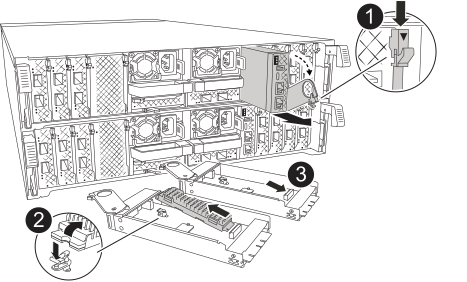

The System Management module is not hot-swappable and consists of:

** Boot media, allowing boot media replacement without removing thr controller module.
** BMC
** Management switch

The System Management module also contains the following ports for external management:

** RJ45 Serial
** USB Serial (Type-C)
** USB Type-A (Boot recovery)
** e0M RJ45 Ethernet

To replace the System Management module or or the boot media, you must shut down the impaired controller.  

.Before you begin
* This procedure uses the following terminology:
 ** The impaired controller is the controller on which you are performing maintenance.
 ** The healthy controller is the HA partner of the impaired controller.
 * All other system components must be working properly.
* The partner controller must be able to take over the impaired controller.
* You must replace the failed component with a replacement FRU component you received from your provider.

== Step 1: Shut down the impaired controller

Shut down or take over the impaired controller using one of the following options.

[role="tabbed-block"]
====

.Option 1: Most systems
--
include::../_include/shutdown_most_frus.adoc[]
--
.Option 2: Controller is in a MetroCluster
--
include::../_include/shutdown_any_mcc_supported.adoc[]
--

====

== Step 2: Replace the impaired System Management module

Replace the impaired system management module.

. Remove the System Management module:
+

+
[cols="1,4"]
|===
a|
image::../media/legend_icon_01.svg[Callout number 1,width=30px]
a|
System Management module cam latch
a|
image::../media/legend_icon_02.svg[Callout number 2,width=30px]
a|
Boot media locking button
a|
image::../media/legend_icon_03.svg[Callout number 3,width=30px]
a|
Replacement System Management module
|===

.. If you are not already grounded, properly ground yourself.
. . Unplug the power cord from the PSU.

+
NOTE: If your system has DC power supplies, disconnect the power cable block from the PSU.
+

.. Remove any cables connected to the System Management module. Make sure that label where the cables were connected, so that you can connect them to the correct ports when you reinstall the module. 
+
NOTE: If your system has DC power supplies, reconnect the power cable block to the PSU.
+
. Rotate the cable management tray up to the closed position.
Remove the System Management module:
.. Depress the system management cam button.
The cam lever moves away from the chassis.
 .. Rotate the cam lever all the way down.
 .. Loop your finger into the cam lever and pull the module straight out of the system.
.. Place the System Management module on an anti-static mat, so that the boot media is accessible.
. Move the boot media to the replacement System Management module:
.. Press the blue locking button.
The boot media rotates slightly upward.
.. Rotate the boot media up,  slide it out of the socket.
.. Install the boot media in the replacement System Management module:
... Align the edges of the boot media with the socket housing, and then gently push it squarely into the socket.
... Rotate the boot media down toward until it engages the locking button. Depress the blue locking if necessary.
Install the system management module:
.. Align the edges of the replacement System Management module with the system opening and gently push it in until  
.. Gently slide the module into the slot until the cam latch begins to engage with the I/O cam pin, and then rotate the cam latch all the way up to lock the module in place.

. Recable the System Management module.
+
NOTE: If your system has DC power supplies, reconnect the power cable block to the PSU.
+
. Rotate the cable management tray up to the closed position.

== Step 3: Reboot the controller module

Reboot the controller module.

. Enter `bye` at the LOADER prompt.
. Return the controller to normal operation by giving back its storage: `storage failover giveback -ofnode _impaired_node_name_`
. Restore automatic giveback by using the `storage failover modify -node local -auto-giveback true` command.
. If an AutoSupport maintenance window was triggered, end it by using the `system node autosupport invoke -node * -type all -message MAINT=END` command.

== Step 4: Return the failed part to NetApp

include::../_include/complete_rma.adoc[]
