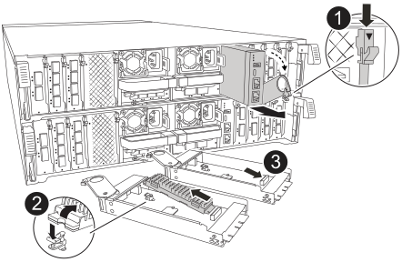

Replace the impaired system management module.

.Steps
. Ensure that all drives in the chassis are firmly seated against the midplane by using your thumbs to push each drive until you feel a positive stop.
// ontap-systems-internal/issues/1151
+
image::../media/drw_a800_drive_seated_IEOPS-960.svg[Seat disk drives]
+
. Make sure NVRAM destage has completed before proceeding.  When the LED on the NV  module is off, NVRAM is destaged.  If the LED is flashing, wait for the flashing to stop. If flashing continues for longer than 5 minutes, contact Technical Support for assistance.
+
image::../media/drw_a1K-70-90_nvram-led_ieops-1463.svg[NVRAM attention and status LED location graphic]
+

[cols="1,4"]

|===
a|
image:../media/icon_round_1.png[Callout number 1] 
a|
NVRAM status LED
a|
image:../media/icon_round_2.png[Callout number 2] 
a|
NVRAM attention LED
|===

* If the NV LED is off, go to the next step.
* If the NV LED is flashing, wait for the flashing to stop. If flashing continues for longer than 5 minutes, contact Technical Support for assistance.

. Go to the rear of the chassis. If you are not already grounded, properly ground yourself. 

.  Unplug the controller's PSUs.

+
NOTE: If your system has DC power, disconnect the power block from the PSUs. 
+

. Rotate the cable management tray down by pulling the buttons on both sides on the inside of the cable management tray and then rotate the tray down.

. Remove any cables connected to the System Management module. Make sure that label where the cables were connected, so that you can connect them to the correct ports when you reinstall the module. 
+
image::../media/drw_70-90_sys-mgmt_remove_ieops-1817.svg[Replace the System Management module]

+
[cols="1,4"]

|===
a|
image::../media/icon_round_1.png[Callout number 1]
a|
System Management module cam latch

|===

+

. Remove the System Management module:
.. Depress the system management cam button.
The cam lever moves away from the chassis.
 .. Rotate the cam lever all the way down.
 .. Loop your finger into the cam lever and pull the module straight out of the system.
.. Place the System Management module on an anti-static mat, so that the boot media is accessible.
. Move the boot media to the replacement System Management module:

+

+
[cols="1,4"]

|===
a|
image::../media/icon_round_1.png[Callout number 1]
a|
System Management module cam latch
a|
image::../media/icon_round_2.png[Callout number 2]
a|
Boot media locking button
a|
image::../media/icon_round_3.png[Callout number 3]
a|
Boot media
|===

.. Press the blue locking button.
The boot media rotates slightly upward.
.. Rotate the boot media up,  slide it out of the socket.
.. Install the boot media in the replacement System Management module:
... Align the edges of the boot media with the socket housing, and then gently push it squarely into the socket.
... Rotate the boot media down toward until it engages the locking button. Depress the blue locking if necessary.
. Install the system management module:
.. Align the edges of the replacement System Management module with the system opening and gently push it into the controller module.  
.. Gently slide the module into the slot until the cam latch begins to engage with the I/O cam pin, and then rotate the cam latch all the way up to lock the module in place.

. Recable the System Management module.

. Plug the power cords into the power supplies. The controller reboots as soon as power is restored.

+
NOTE: If you have DC power supplies, reconnect the power block to the power supplies.

+ 

 . Rotate the cable management tray up to the closed position.