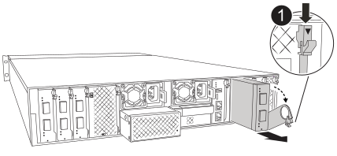

Hot swap the failed I/O module with an equivalent I/O module.

CAUTION: Always wear a grounded wrist strap connected to a verified ground point during installation and maintenance procedures. Failure to follow proper ESD precautions can cause permanent damage to controller nodes, storage shelves, and network switches.

.Steps

. Rotate the cable management tray down by pulling the buttons on the inside of the cable management tray and rotating it down.

. Remove the I/O module from the controller module:

+
NOTE: The following illustration shows removing a vertical I/O module. Typically, you will only remove one I/O module.
+

+
[cols="1,4"]
|===
a|
image:../media/icon_round_1.png[Callout number 1]  
a|
Cam locking button

|===

.. Depress the cam latch button.
.. Rotate the cam latch away from the module as far as it will go.
.. Remove the module from the controller module by hooking your finger into the cam lever opening and pulling the module out of the controller module.
+
Keep track of which slot the I/O module was in.
+
. Set the I/O module aside.

. Install the replacement I/O module into the target slot:
.. Align the I/O module with the edges of the slot.
.. Gently slide the module into the slot all the way into the controller module, and then rotate the cam latch all the way up to lock the module in place.

. Cable the I/O module.

. Rotate the cable management tray into the locked position.
