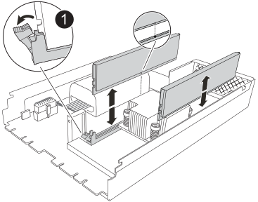

The NVRAM12-EX module consists of the NVRAM12 hardware and field-replaceable DIMMs. You can replace a failed NVRAM12-EX module, the DIMMs, or the NVRAM battery inside the NVRAM12-EX module. 

.Before you begin
* Make sure you have the replacement part available. You must replace the failed component with a replacement component you received from NetApp.

* Make sure all other components in the storage system are functioning properly; if not, contact https://support.netapp.com[NetApp support].
+ 
NOTE: Before you replace the NVRAM12-EX module, make sure that you power down the impaired controller before proceeding with the replacement. 

== Step 1: Shut down the impaired controller

Shut down or take over the impaired controller.

include::../_include/shutdown_most_frus_afx_2k.adoc[]

== Step 2: Replace the NVRAM12-EX module, NVRAM DIMM, or NVRAM battery

Replace the NVRAM12-EX module, NVRAM DIMMs, or NVRAM battery using the following options.

You must remove the controller module from the enclosure when you replace the controller module or replace a component inside the controller module.

// start tabbed area

[role="tabbed-block"]
====

.Option 1: Replace the NVRAM12-EX module
--

To replace the NVRAM12-EX module, locate it in slot 6/7 in the enclosure and follow the specific sequence of steps.

. Check the NVRAM status LED located in slot 4/5 and the NVRAM12-EX status slot 6/7 of the system. There is also an NVRAM LED on the front panel of the controller module. Look for the NV icon:
+
image::../media/drw_a1K-70-90_nvram-led_ieops-1463.svg[NVRAM attention and status LED location graphic]
+
[cols="1,4"]
|===
2+h| *NVRAM*
a|
image:../media/icon_round_1.png[Callout number 1] 
a|
NVRAM status LED
a|
image:../media/icon_round_2.png[Callout number 2] 
a|
NVRAM attention LED
|===
+
image::../media/drw_afx_emr_nvram-led_ieops-2962.svg[NVRAM12-EX attention and status LED location graphic]
+
[cols="1,4"]
|===
2+h| *NVRAM12-EX*
a|
image:../media/icon_round_1.png[Callout number 1] 
a|
NVRAM12-EX status LED
a|
image:../media/icon_round_2.png[Callout number 2] 
a|
NVRAM12-EX attention LED
|===

* If the NV LED is off, go to the next step.
* If the NV LED is flashing, wait for the flashing to stop. If flashing continues for longer than 5 minutes, contact Technical Support for assistance.
. If you are not already grounded, properly ground yourself.
. Unplug the power supply cables from the PSUs from the controller.
. Rotate the cable management tray down by gently pulling the pins on the ends of the tray and rotating the tray down.
. Remove the impaired NVRAM12-EX module from the enclosure:
 .. Press in the locking cam button.
 .. Remove the impaired NVRAM12-EX module from the enclosure by pulling the module out of the enclosure.
+
image::../media/drw_afx_emr_nv12l_remove_replace_ieops-2879.svg[Remove the NVRAM12-EX module]
+
[cols="1,4"]
|===
a|
image:../media/icon_round_1.png[Callout number 1] |
Cam locking button
|===

. Set the NVRAM12-EX module on a stable surface.
. Open the cover of of the NVRAM12-EX module by using your fingers or a screwdriver to loosen the single thumbscrew on the cover and lifting the cover off of the module.
+
image::../media/drw_afx_emr_nv12l_remove_cover_ieops-2929.svg[Remove the NVRAM12-EX cover]
+
[cols="1,4"]
|===
a|
image:../media/icon_round_1.png[Callout number 1] |
Thumbscrew for NVRAM12-EX cover
|===

. Remove the DIMMs, one at a time, from the impaired NVRAM12-EX module and install them in the replacement NVRAM12-EX module.
+

+
[cols="1,4"]
|===
a|
image:../media/icon_round_1.png[Callout number 1] |
DIMM locking tabs
|===

. Disconnect the battery from the NVRAM12-EX module: 
 .. Squeeze the clip on the face of the battery plug to release the plug from the socket. 
 .. Unplug the battery cable from the socket. 
. Remove the disconnected battery by lifting up on the battery to remove it from the module.
+
image::../media/drw_afx_emr_nv12l_remove_battery_ieops-2919.svg[Remove the NVRAM12-EX battery]
+
[cols="1,4"]
|===
a|
image:../media/icon_round_1.png[Callout number 1] |
NVRAM12-EX battery connection clip
|===
. Install the battery into the replacement NVRAM12-EX module:
 .. Plug the battery connection clip into the socket and make sure that the plug locks into place.
 .. Insert the battery pack into the slot and press firmly down on the battery pack to make sure that it is locked into place.

. Install the cover of the NVRAM12-EX module by aligning the cover with the screw hole and securing the cover with the thumbscrew.
. Install the replacement NVRAM12-EX module into the enclosure:
 .. Align the module with the edges of the enclosure opening in slot 6/7.
 .. Gently slide the module into the slot all the way to lock the module in place.
. Rotate the cable management tray up to the closed position.

--
.Option 2: Replace the NVRAM DIMM
--

To replace NVRAM DIMMs in the NVRAM12-EX module, you must remove the NVRAM12-EX module, and then replace the target DIMM.

. Check the NVRAM status LED located in slot 4/5 and the NVRAM12-EX status slot 6/7 of the system. There is also an NVRAM LED on the front panel of the controller module. Look for the NV icon:
+
image::../media/drw_a1K-70-90_nvram-led_ieops-1463.svg[NVRAM attention and status LED location graphic]
+
[cols="1,4"]
|===
2+h| *NVRAM*
a|
image:../media/icon_round_1.png[Callout number 1] 
a|
NVRAM status LED
a|
image:../media/icon_round_2.png[Callout number 2] 
a|
NVRAM attention LED
|===
+
image::../media/drw_afx_emr_nvram-led_ieops-2962.svg[NVRAM12-EX attention and status LED location graphic]
+
[cols="1,4"]
|===
2+h| *NVRAM12-EX*
a|
image:../media/icon_round_1.png[Callout number 1] 
a|
NVRAM12-EX status LED
a|
image:../media/icon_round_2.png[Callout number 2] 
a|
NVRAM12-EX attention LED
|===

* If the NV LED is off, go to the next step.
* If the NV LED is flashing, wait for the flashing to stop. If flashing continues for longer than 5 minutes, contact Technical Support for assistance.
. If you are not already grounded, properly ground yourself.
. Unplug the power supply cables from the PSUs.
. Rotate the cable management tray down by gently pulling the pins on the ends of the tray and rotating the tray down.
. Remove the target NVRAM12-EX module from the enclosure:
 .. Press in the locking cam button.
 .. Remove the impaired NVRAM12-EX module from the enclosure by pulling the module out of the enclosure.
+
image::../media/drw_afx_emr_nv12l_remove_replace_ieops-2879.svg[Remove the NVRAM12-EX module]
+
[cols="1,4"]
|===
a|
image:../media/icon_round_1.png[Callout number 1] |
Cam locking button
|===

. Set the NVRAM12-EX module on a stable surface.
. Open the cover of of the NVRAM12-EX module by using your fingers or a screwdriver to loosen the single thumbscrew on the cover and lifting the cover off of the module.
+
image::../media/drw_afx_emr_nv12l_remove_cover_ieops-2929.svg[Remove the NVRAM12-EX cover]
+
[cols="1,4"]
|===
a|
image:../media/icon_round_1.png[Callout number 1] |
Thumbscrew for NVRAM12-EX cover
|===

. Locate the DIMM to be replaced inside the NVRAM12-EX module.

+
NOTE: Consult the FRU map label on the side of the NVRAM12-EX module to determine the locations of DIMM slots 1 and 2.
+

. Remove the DIMM by pressing down on the DIMM locking tabs and lifting the DIMM out of the socket.
+

+
[cols="1,4"]
|===
a|
image:../media/icon_round_1.png[Callout number 1] |
DIMM locking tabs
|===

. Install the replacement DIMM by aligning the DIMM with the socket and gently pushing the DIMM into the socket until the locking tabs lock in place.
. Install the cover of the NVRAM12-EX module by aligning the cover with the screw hole and securing the cover with the thumbscrew.
. Install the NVRAM12-EX module into the enclosure:
 .. Gently slide the module into the slot all the way to lock into place.
. Rotate the cable management tray up to the closed position.

--
.Option 3: Replace the NVRAM Battery
--

To replace NVRAM DIMMs in the NVRAM12-EX module, you must remove the NVRAM12-EX module, and then replace the battery.

. Check the NVRAM status LED located in slot 4/5 and the NVRAM12-EX status slot 6/7 of the system. There is also an NVRAM LED on the front panel of the controller module. Look for the NV icon:
+
image::../media/drw_a1K-70-90_nvram-led_ieops-1463.svg[NVRAM attention and status LED location graphic]
+
[cols="1,4"]
|===
2+h| *NVRAM*
a|
image:../media/icon_round_1.png[Callout number 1] 
a|
NVRAM status LED
a|
image:../media/icon_round_2.png[Callout number 2] 
a|
NVRAM attention LED
|===
+
image::../media/drw_afx_emr_nvram-led_ieops-2962.svg[NVRAM12-EX attention and status LED location graphic]
+
[cols="1,4"]
|===
2+h| *NVRAM12-EX*
a|
image:../media/icon_round_1.png[Callout number 1] 
a|
NVRAM12-EX status LED
a|
image:../media/icon_round_2.png[Callout number 2] 
a|
NVRAM12-EX attention LED
|===

* If the NV LED is off, go to the next step.
* If the NV LED is flashing, wait for the flashing to stop. If flashing continues for longer than 5 minutes, contact Technical Support for assistance.
. If you are not already grounded, properly ground yourself.
. Unplug the power supply cables from the PSUs.
. Rotate the cable management tray down by gently pulling the pins on the ends of the tray and rotating the tray down.
. Remove the target NVRAM12-EX module from the enclosure:
 .. Press in the locking cam button.
 .. Remove the impaired NVRAM12-EX module from the enclosure by pulling the module out of the enclosure.
+
image::../media/drw_afx_emr_nv12l_remove_replace_ieops-2879.svg[Remove the NVRAM12-EX module]
+
[cols="1,4"]
|===
a|
image:../media/icon_round_1.png[Callout number 1] |
Cam locking button
|===

. Set the NVRAM12-EX module on a stable surface.
. Open the cover of of the NVRAM12-EX module by using your fingers or a screwdriver to loosen the single thumbscrew on the cover and lifting the cover off of the module.
+
image::../media/drw_afx_emr_nv12l_remove_cover_ieops-2929.svg[Remove the NVRAM12-EX cover]
+
[cols="1,4"]
|===
a|
image:../media/icon_round_1.png[Callout number 1] |
Thumbscrew for NVRAM12-EX cover
|===

. Disconnect the battery from the NVRAM12-EX module: 
 .. Squeeze the clip on the face of the battery plug to release the plug from the socket. 
 .. Unplug the battery cable from the socket. 
. Remove the disconnected battery by lifting up on the battery to remove it from the module.
+
image::../media/drw_afx_emr_nv12l_remove_battery_ieops-2919.svg[Remove the NVRAM12-EX battery]
+
[cols="1,4"]
|===
a|
image:../media/icon_round_1.png[Callout number 1] |
NVRAM12-EX battery connection clip
|===

. Remove the replacement battery from its package.
. Install the replacement battery pack into the NVRAM12-EX module:
 .. Plug the battery connection clip into the socket and make sure that the plug locks into place.
 .. Insert the battery pack into the slot and press firmly down on the battery pack to make sure that it is locked into place.
. Install the cover of the NVRAM12-EX module by aligning the cover with the screw hole and securing the cover with the thumbscrew.
. Install the NVRAM12-EX module into the enclosure:
 .. Gently slide the module into the slot all the way to lock into place.
. Rotate the cable management tray up to the closed position.

====

// end tabbed area

== Step 3: Reboot the controller

After you replace the FRU, you must reboot the controller module.

. Plug the power cables back into the PSU. 
+
The system will begin to reboot, typically to the LOADER prompt.
+
. Enter `bye` at the LOADER prompt.

== Step 4: Complete NVRAM12-EX replacement

Perform the following steps to complete the NVRAM12-EX replacement.

.Steps
. From the healthy controller, verify that the new partner system ID has been automatically assigned: 
`_storage failover show_`
+
In the command output, you should see a message displaying the current state of the storage replacement. In the following example, `node2` has undergone replacement and displays the current state as `In takeover`.
+
----
node1:> storage failover show
                                    Takeover
Node              Partner           Possible     State Description
------------      ------------      --------     -------------------------------------
node1             node2             false        In takeover  
node2             node1             -            Waiting for giveback
----

. Give back the controller:
 .. From the healthy controller, give back the replaced controller's storage: `_storage failover giveback -ofnode impaired_node_name_`
+
The controller takes back its storage and completes booting.
+
NOTE: If the giveback is vetoed, you can consider overriding the vetoes.
+
For more information, see the https://docs.netapp.com/us-en/ontap/high-availability/ha_manual_giveback.html#if-giveback-is-interrupted[Manual giveback commands^] topic to override the veto.

 .. After the giveback has been completed, confirm that the HA pair is healthy and that takeover is possible: _storage failover show_
+
The output from the `storage failover show` command should not include the System ID changed on partner message.

. Verify that the expected volumes are present for each controller:
+ 
`vol show -node node-name`

. Press <enter> when console messages stop.
* If you see the _login_ prompt, go to the next step.
* If you do not see login prompt, log into the partner node.
. Wait 5 minutes after the giveback report completes, and check failover status and giveback status:
+
`storage failover show` and `storage failover show-giveback`
+
NOTE: The following command is only available in the Diagnostic mode privilege level.

. If automatic giveback was disabled, reenable it:
+ 
`storage failover modify -node local -auto-giveback-of true`

. If AutoSupport is enabled, restore/unsuppress automatic case creation:
+ 
`system node autosupport invoke -node * -type all -message MAINT=END`

== Step 5: Return the failed part to NetApp

include::../_include/complete_rma.adoc[]
