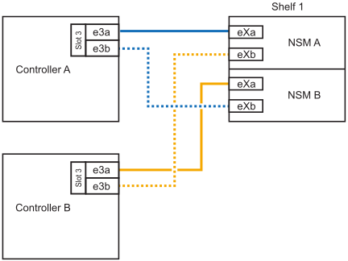
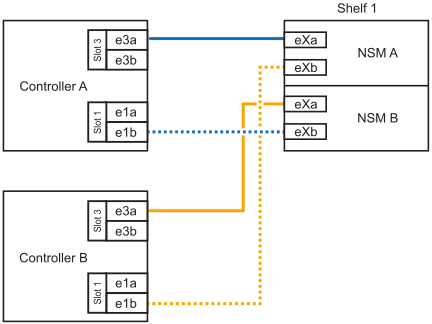

.Before you begin

* You must have reviewed the link:requirements-hot-add-shelf.html[hot-add requirements and best practices]. 

* You must have completed the applicable procedures in link:prepare-hot-add-shelf.html[Prepare-to hot-add a shelf]. 

* You must have installed the shelves, powered them on, and set the shelf IDs as described in link:prepare-hot-add-shelf.html[Install a shelf for a hot-add].

.About this task

* This procedure assumes that your HA pair has only internal storage (no external shelves) and that you are hot-adding up to one additional shelf.

* This procedure addresses the following hot-add scenarios:
** Hot-adding the first shelf to an HA pair with one RoCE-capable I/O module in each controller.
** Hot-adding the first shelf to an HA pair with two RoCE-capable I/O modules in each controller.

* These systems are compatible with both NS224 shelves with NSM100 modules and NS224 shelves with NSM100B modules. To ensure you cable your controllers to the correct ports, replace the "X" in each diagram with the correct port number for your module:
+
[cols="1,4"]
|===
a|Module type a|Port labeling

a|
NSM100
a|
"0"

ex. e0a

a|
NSM100B
a|
"1"

ex. e1a
|===

.Steps

. If you are hot-adding one shelf using one set of RoCE-capable ports (one RoCE-capable I/O module) in each controller module, and this is the only NS224 shelf in your HA pair, complete the following substeps.
+
Otherwise, go to the next step.
+
NOTE: This step assumes you installed the RoCE-capable I/O module in slot 3.
+
.. Cable shelf NSM A port eXa to controller A slot 3 port a (e3a).
.. Cable shelf NSM A port eXb to controller B slot 3 port b (e3b).
.. Cable shelf NSM B port eXa to controller B slot 3 port a (e3a).
.. Cable shelf NSM B port eXb to controller A slot 3 port b (e3b).
+
The following illustration shows cabling for one hot-added shelf using one RoCE-capable I/O module in each controller module: 
+

. If you are hot-adding one shelf using two sets of RoCE-capable ports (two RoCE-capable I/O modules) in each controller module, complete the following substeps.

.. Cable NSM A port eXa to controller A slot 3 port a (e3a).
.. Cable NSM A port eXb to controller B slot 1 port b (e1b).
.. Cable NSM B port eXa to controller B slot 3 port a (e3a).
.. Cable NSM B port eXb to controller A slot 1 port b (e1b).

The following illustration shows cabling for one hot-added shelf
using two RoCE-capable I/O modules in each controller module: 

. Verify that the hot-added shelf is cabled correctly using https://mysupport.netapp.com/site/tools/tool-eula/activeiq-configadvisor[Active IQ Config Advisor^].
+
If any cabling errors are generated, follow the corrective actions provided.

.What's next?
If you disabled automatic drive assignment as part of the preparation for this procedure, you need to manually assign drive ownership and then reenable automatic drive assignment, if needed. Go to link:complete-hot-add-shelf.html[Complete the hot-add].

Otherwise, you are done with the hot-add shelf procedure.
