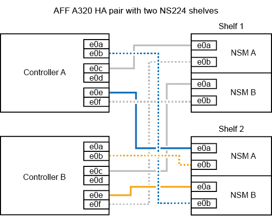

.Steps

. Cable the shelf to the controllers.
 .. Cable NSM A port e0a to controller A port e0e.
 .. Cable NSM A port e0b to controller B port e0b.
 .. Cable NSM B port e0a to controller B port e0e.
 .. Cable NSM B port e0b to controller A port e0b.
 +
The following illustration shows cabling for the hot-added shelf (shelf 2):
+

. Verify that the hot-added shelf is cabled correctly using https://mysupport.netapp.com/site/tools/tool-eula/activeiq-configadvisor[Active IQ Config Advisor^].
+
If any cabling errors are generated, follow the corrective actions provided.

