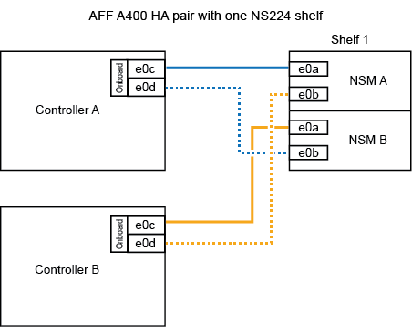
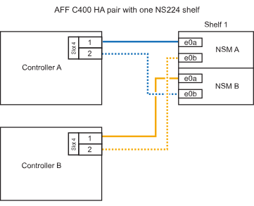
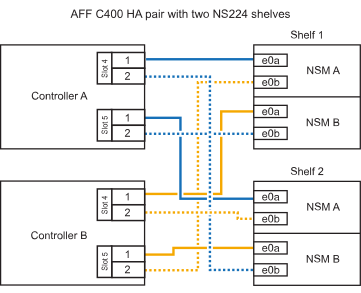

== Cable shelf to an A400 HA pair

For an A400 HA pair, you can hot-add up to two shelves and use onboard ports e0c/e0d and ports in slot 5 as needed. 

.Steps

. If you are hot-adding one shelf using one set of RoCE-capable ports (onboard RoCE-capable ports) on each controller, and this is the only NS224 shelf in your HA pair, complete the following substeps.
+
Otherwise, go to the next step.

 .. Cable shelf NSM A port e0a to controller A port e0c.
 .. Cable shelf NSM A port e0b to controller B port e0d.
 .. Cable shelf NSM B port e0a to controller B port e0c.
 .. Cable shelf NSM B port e0b to controller A port e0d.
+
The following illustration shows cabling for one hot-added shelf using one set of RoCE-capable ports on each controller:
+

. If you are hot-adding one or two shelves using two sets of RoCE-capable ports (on board and PCIe card RoCE-capable ports) on each controller, complete the following substeps.
+
[options="header" cols="1,3"]
|===
| Shelves| Cabling
a|
Shelf 1
a|

 .. Cable NSM A port e0a to controller A port e0c.
 .. Cable NSM A port e0b to controller B slot 5 port 2 (e5b).
 .. Cable NSM B port e0a to controller B port e0c.
 .. Cable NSM B port e0b to controller A slot 5 port 2 (e5b).
 .. If you are hot-adding a second shelf, complete the "`Shelf 2`" substeps; otherwise, go to the next step.

a|
Shelf 2
a|

 .. Cable NSM A port e0a to controller A slot 5 port 1 (e5a).
 .. Cable NSM A port e0b to controller B port e0d.
 .. Cable NSM B port e0a to controller B slot 5 port 1 (e5a).
 .. Cable NSM B port e0b to controller A port e0d.
 .. Go to the next step.

+
|===
The following illustration shows cabling for two hot-added shelves:
+
image::../media/drw_ns224_a400_2shelves_IEOPS-983.svg[Cabling for an /ASA A400 with two NS224 shelves and one set of onboard ports and one set of ports on PCIe cards, width=452px]

. Verify that the hot-added shelf is cabled correctly using https://mysupport.netapp.com/site/tools/tool-eula/activeiq-configadvisor[Active IQ Config Advisor^].
+
If any cabling errors are generated, follow the corrective actions provided.

== Cable shelf to a C400 HA pair

For a C400 HA pair, you can hot-add up to two shelves and use ports in slot 4 and 5 as needed.

.Steps

. If you are hot-adding one shelf using one set of RoCE-capable ports on each controller, and this is the only NS224 shelf in your HA pair, complete the following substeps.
+
Otherwise, go to the next step.

 .. Cable shelf NSM A port e0a to controller A slot 4 port 1 (e4a).
 .. Cable shelf NSM A port e0b to controller B slot 4 port 2 (e4b).
 .. Cable shelf NSM B port e0a to controller B slot 4 port 1 (e4a).
 .. Cable shelf NSM B port e0b to controller A slot 4 port 2 (e4b).
+
The following illustration shows cabling for one hot-added shelf using one set of RoCE-capable ports on each controller:
+

. If you are hot-adding one or two shelves using two sets of RoCE-capable ports on each controller, complete the following substeps.
+
[options="header" cols="1,3"]
|===
| Shelves| Cabling
a|
Shelf 1
a|

 .. Cable NSM A port e0a to controller A slot 4 port 1 (e4a).
 .. Cable NSM A port e0b to controller B slot 5 port 2 (e5b).
 .. Cable NSM B port e0a to controller B port slot 4 port 1 (e4a).
 .. Cable NSM B port e0b to controller A slot 5 port 2 (e5b).
 .. If you are hot-adding a second shelf, complete the "`Shelf 2`" substeps; otherwise, go to the next step.

a|
Shelf 2
a|

 .. Cable NSM A port e0a to controller A slot 5 port 1 (e5a).
 .. Cable NSM A port e0b to controller B slot 4 port 2 (e4b).
 .. Cable NSM B port e0a to controller B slot 5 port 1 (e5a).
 .. Cable NSM B port e0b to controller A slot 4 port 2 (e4b).
 .. Go to the next step.

+
|===
The following illustration shows cabling for two hot-added shelves:
+

. Verify that the hot-added shelf is cabled correctly using https://mysupport.netapp.com/site/tools/tool-eula/activeiq-configadvisor[Active IQ Config Advisor^].
+
If any cabling errors are generated, follow the corrective actions provided.

