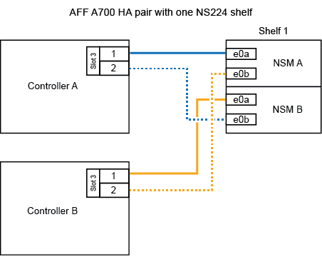
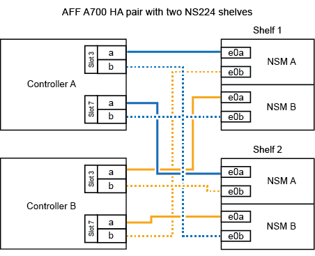

.Before you begin

* If you are hot-adding the initial NS224 shelf (no NS224 shelf exists in your HA pair), you must install a core dump module (X9170A, NVMe 1TB SSD) in each controller to support core dumps (store core files). 
+
See link:../fas9000/caching-module-and-core-dump-module-replace.html[Replace the caching module or add/replace a core dump module -- AFF A700 and FAS9000^].

.About this task

How you cable an NS224 shelf to an AFF A700 HA pair depends on the number of shelves you are hot-adding and the number of RoCE-capable port sets (one or two) you are using on the controllers.

.Steps

. If you are hot-adding one shelf using one set of RoCE-capable ports (one RoCE capable I/O module) on each controller, and this is the only NS224 shelf in your HA pair, complete the following substeps.
+
Otherwise, go to the next step.
+
NOTE: This step assumes that you installed the RoCE-capable I/O module in slot 3, instead of slot 7, on each controller.

 .. Cable shelf NSM A port e0a to controller A slot 3 port a.
 .. Cable shelf NSM A port e0b to controller B slot 3 port b.
 .. Cable shelf NSM B port e0a to controller B slot 3 port a.
 .. Cable shelf NSM B port e0b to controller A slot 3 port b.
+
The following illustration shows cabling for one hot-added shelf using one RoCE-capable I/O module in each controller:
+

. If you are hot-adding one or two shelves using two sets of RoCE-capable ports (two RoCE-capable I/O modules) in each controller, complete the applicable substeps.
+
[options="header" cols="1,3"]
|===
| Shelves| Cabling
a|
Shelf 1
a|
NOTE: These substeps assume that you are beginning the cabling by cabling shelf port e0a to the RoCE-capable I/O module in slot 3, instead of slot 7.

 .. Cable NSM A port e0a to controller A slot 3 port a.
 .. Cable NSM A port e0b to controller B slot 7 port b.
 .. Cable NSM B port e0a to controller B slot 3 port a.
 .. Cable NSM B port e0b to controller A slot 7 port b.
 .. If you are hot-adding a second shelf, complete the "`Shelf 2`" substeps; otherwise, go to the next step.

a|
Shelf 2
a|
NOTE: These substeps assume that you are beginning the cabling by cabling shelf port e0a to the RoCE-capable I/O module in slot 7, instead of slot 3 (which correlates with the cabling substeps for shelf 1).

 .. Cable NSM A port e0a to controller A slot 7 port a.
 .. Cable NSM A port e0b to controller B slot 3 port b.
 .. Cable NSM B port e0a to controller B slot 7 port a.
 .. Cable NSM B port e0b to controller A slot 3 port b.
 .. Go to the next step.

+
|===
The following illustration shows cabling for the first and second hot-added shelves:
+

. Verify that the hot-added shelf is cabled correctly using https://mysupport.netapp.com/site/tools/tool-eula/activeiq-configadvisor[Active IQ Config Advisor^].
+
If any cabling errors are generated, follow the corrective actions provided.

