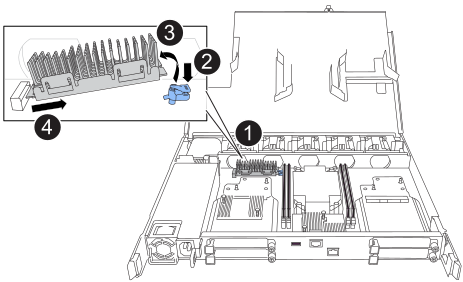

To replace the boot media, you must remove the impaired controller, remove the boot media, install the replacement boot media, and transfer the boot image to a USB flash drive.

== Step 1: Replace the boot media

The boot media is located inside the System Management module and is accessed by removing the module from the system.

[cols="1,4"]
|===
a|
image::../media/legend_icon_01.svg[Callout number 1,width=30px] 
a|
System Management module cam latch
a|
image::../media/legend_icon_02.svg[Callout number 2,width=30px]
a|
Boot media locking button
a|
image::../media/legend_icon_03.svg[Callout number 3,width=30px]
a|
Boot media
|===

. On the front of the chassis, use your thumbs to firmly push each drive in until you feel a positive stop. This ensures that the drives are firmly seated against the chassis midplane.  
+
image::../media/drw_a800_drive_seated_IEOPS-960.svg[width=400px]
+
. Go to the rear of the chassis. If you are not already grounded, properly ground yourself. 

. Disconnect power to the controller by pulling the controller out of the chassis about three inches:
.. Press down on both of the controller locking latches, and then rotate both latches downward at the same time.
.. Pull out the controller about 3 inches from the chassis to disengage power.

.. Remove any cables connected to the controller. Make sure to label where the cables were connected, so that you can connect them to the correct ports when you reinstall the controller.
.. Place the controller on an anti-static mat, so that the boot media is accessible?
. Remove the boot media:
.. Press the blue locking button.
.. Rotate the boot media up,  slide it out of the socket, and set it aside.
. Install the replacement boot media:
.. Align the edges of the boot media with the socket housing, and then gently push it squarely into the socket.
.. Rotate the boot media down toward the locking button. 
.. Push the locking button, rotate the boot media all the way down and then release the locking button.
. Reinstall the controller: 
.. Rotate the cable management tray up to the closed position.
.. Recable the controller.

== Step 2: Transfer the boot image to the boot media

The replacement boot media that you installed is without an ONTAP image so you need to transfer an ONTAP image using a USB flash drive.

.Before you begin

 * You must have a USB flash drive, formatted to FAT32, with at least 4GB capacity.
 * You must have a copy of the same image version of ONTAP as what the impaired controller was running. You can download the appropriate image from the https://support.netapp.com/downloads[Downloads] section on the NetApp Support Site
  ** If NVE is supported, download the image with NetApp Volume Encryption, as indicated in the download button.
  ** If NVE is not supported, download the image without NetApp Volume Encryption, as indicated in the download button.
 * If your storage system is an HA pair, you must have a network connection between the node management ports of the controllers (typically the e0M interfaces).
 
.Steps
 . Download and copy the appropriate service image from the https://mysupport.netapp.com/[NetApp Support Site] to the USB flash drive.
.. Download the service image from the Downloads link on the page, to your work space on your laptop.
.. Unzip the service image.
+

NOTE: If you are extracting the contents using Windows, do not use WinZip to extract the netboot image. Use another extraction tool, such as 7-Zip or WinRAR.

+
 
The USB flash drive should have the appropriate ONTAP image of what the impaired controller is running.

.. Remove the USB flash drive from your laptop.
. Insert the USB flash drive into the USB-A port on the impaired controller. 
+
Make sure that you install the USB flash drive in the slot labeled for USB devices, and not in the USB console port.

. Reconnect power to the controller:
.. Firmly push the controller into the chassis until it meets the midplane and is fully seated.
+
The locking latches rise when the controller is fully seated?
+
.. Rotate the locking latches upward into the locked position.
+
The controller begins to boot as soon as power is reconnected.

 . Interrupt the boot process by pressing Ctrl-C to stop at the LOADER prompt.
+
If you miss this message, press Ctrl-C, select the option to boot to Maintenance mode, and then halt the controller to boot to LOADER.

. Set your network connection type at the LOADER prompt:
 ** If you are configuring DHCP: `ifconfig e0M -auto`
+
NOTE: The target port you configure is the target port you use to communicate with the impaired controller from the healthy controller during var file system restore with a network connection. You can also use the e0M port in this command.

 ** If you are configuring manual connections: `ifconfig e0M -addr=filer_addr -mask=netmask -gw=gateway`
  *** filer_addr is the IP address of the storage system.
  *** netmask is the network mask of the management network that is connected to the HA partner.
  *** gateway is the gateway for the network.
  
+
NOTE: Other parameters might be necessary for your interface. You can enter help ifconfig at the firmware prompt for details.
