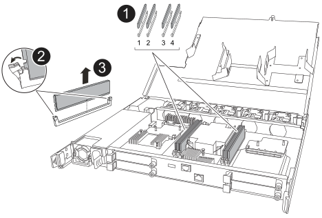

To replace the controller, you must remove the impaired controller, move FRU components from the impaired controller to the replacement controller, install the replacement controller in the chassis, and then boot the system to Maintenance mode.

== Step 1: Remove the controller

include::../_include/g_controller_remove.adoc[]

== Step 2: Move the power supply

Move the power supply (PSU) to the replacement controller.

. Move the PSU from the impaired controller:
+
Make sure the left side controller handle is in the upright position to allow you access to the PSU.

[role="tabbed-block"]
====

.Option 1: Move an AC PSU
--
To move an AC PSU, complete the following steps.

.Steps

. Remove the AC PSU from the impaired controller:
+
image::../media/drw_g_t_psu_replace_ieops-1899.svg[Replace AC PSU]

+
[cols="1,4"]
|===
a|
image::../media/icon_round_1.png[Callout number 1]
a|
Rotate the PSU handle up, to its horizontal position, and then grasp it.
a|
image::../media/icon_round_2.png[Callout number 2]
a|
With your thumb, press the blue tab to release the PSU from the controller.
a|
image::../media/icon_round_3.png[Callout number 3]
a|
Pull the PSU out of the controller while using your other hand to support its weight. 

CAUTION: The PSU is short. Always use two hands to support it when removing it from the controller so that it does not suddenly swing free from the controller and injure you.
|===
+
. Install the PSU into the replacement controller:
.. Using both hands, support and align the edges of the PSU with the opening in the controller.
.. Gently push the PSU into the controller until the locking tab clicks into place.
+
A PSU will only properly engage with the internal connector and lock in place one way.
+
NOTE: To avoid damaging the internal connector, do not use excessive force when sliding the PSU into the controller.
+
.. Rotate the handle down, so it is out of the way of normal operations.

--

.Option 2: Move a DC PSU

--
To move a DC PSU, complete the following steps.

.Steps 

. Remove the DC PSU from the impaired controller:

.. Rotate the handle up, to its horizontal position, and then grasp it.

.. With your thumb, press the terracotta tab to release the locking mechanism.

.. Pull the PSU out of the controller while using your other hand to support its weight.
+
NOTE: The PSU is short. Always use two hands to support it when removing it from the controller so that it does not swing free from the controller and injure you.
+
image::../media/drw_dcpsu_remove-replace-generic_IEOPS-788.svg[Remove a DC PSU,width=500px]

+
[cols="1,4"]

|===
a|
image::../media/icon_round_1.png[Callout number 1]
a|
Thumb screws
a| 
image::../media/icon_round_2.png[Callout number 2]
a|
D-SUB DC power PSU cord connector
a|
image::../media/icon_round_3.png[Callout number 3]
a|
Power supply handle
a|
image::../media/icon_round_4.png[Callout number 4]
a|
Terracotta PSU locking tab
|===

. Insert the PSU into the replacement controller:
.. Using both hands, support and align the edges of the PSU with the opening in the controller.
.. Gently slide the PSU into the controller until the locking tab clicks into place.
+
A PSU must properly engage with the internal connector and locking mechanism. Repeat this step if you feel the PSU is not properly seated.
+
NOTE: To avoid damaging the internal connector, do not use excessive force when sliding the PSU into the controller.
+
.. Rotate the handle down, so it is out of the way of normal operations.

--
====

== Step 3: Move the fans

Move the fans to the replacement controller.

. Remove one of the fans from the impaired controller:
+
image::../media/drw_g_fan_replace_ieops-1903.svg[Fan replace]

+
[cols="1,4"]
|===
a|
image::../media/icon_round_1.png[Callout number 1]|
Hold both sides of the fan at the blue touch points.
a|
image::../media/icon_round_2.png[Callout number 2]|
Pull the fan straight up and out its socket.
|===

+

.  Insert the fan into the replacement controller by aligning it within the guides, and then push down until the fan connector is fully seated in the socket.

. Repeat these steps for the remaining fans.

== Step 4: Move the NV battery

Move the NV battery to the replacement controller.

. Remove the NV battery from the impaired controller:
+
*Attention:* The NV module LED blinks while destaging contents to the flash memory when you halt the storage system. After the destage is complete, the LED turns off.
+
image::../media/drw_g_nv_battery_replace_ieops-1864.svg[Replace the NV battery]
+
[cols="1,4"]

|===
a|
image::../media/icon_round_1.png[Callout number 1]
a|
Lift the NV battery up and out of its holder.
a|
image::../media/icon_round_2.png[Callout number 2]
a|
Remove the wiring harness from its retainer.
a|
image::../media/icon_round_3.png[Callout number 3]
a| 
a. Push in and hold the tab on the connector.

b. Pull the connector up and out of the socket.
|===

. Install the NV battery into the replacement controller:
.. Plug the wiring connector into its socket.
+
You might need to slightly rock the connector lengthwise until it is fully seated.
+
.. Route the wiring along the side of the power supply, into its retainer, and then through the channel in front of the NV battery holder.
.. Place the NV battery into the holder.
+
The NV battery should sit flush to the holder floor.
 
== Step 5: Move system DIMMs

Move the DIMMs to the replacement controller.

If you have DIMM blanks, you do not need to move them, the replacement controller should come with them installed.

. Remove one of the DIMMs from the impaired controller:
+

+
[cols="1,4"]

|===
a|
image::../media/icon_round_1.png[Callout number 1]
a|
DIMM slot numbering and positions.
a|
image::../media/icon_round_2.png[Callout number 1]
a|
* Note the orientation of the DIMM in the socket so that you can insert the DIMM in the replacement controller in the proper orientation.
* Eject the faulty DIMM by slowly pushing apart the two DIMM ejector tabs on both ends of the DIMM slot.

IMPORTANT: Carefully hold the DIMM by the corners or edges to avoid pressure on the DIMM circuit board components.
a|
image::../media/icon_round_3.png[Callout number 3]
a|
Lift the DIMM up and out of the slot.

The ejector tabs remain in the open position.
|===

. Install the DIMM in the replacement controller:

.. Make sure that the DIMM ejector tabs on the connector are in the open position.

.. Hold the DIMM by the corners, and then insert the DIMM squarely into the slot.
+
The notch on the bottom of the DIMM, among the pins, should line up with the tab in the slot.
+
When inserted correctly, the DIMM should go in easily but fit tightly in the slot. If not, reinsert the DIMM.

.. Visually inspect the DIMM to verify that it is evenly aligned and fully inserted into the slot.

.. Push down carefully, but firmly, on the top edge of the DIMM until the ejector tabs snap into place over the notches at both ends of the DIMM.

. Repeat these steps for the remaining DIMMs.

== Step 6: Move the I/O modules

Move the I/O modules and any I/O blanking modules to the replacement controller.

. Unplug cabling from one of the I/O modules.
+
Make sure to label the cables so that you know where they came from.

. Remove the I/O module from the impaired controller:
+
Make sure that you keep track of which slot the I/O module was in.
+
image::../media/drw_g_io_module_replace_ieops-1900.svg[Remove I/O module]
+
[cols="1,4"]
|===

a|
image::../media/icon_round_1.png[Callout number 1]
a|
Turn the I/O module thumbscrew counterclockwise to loosen.
a|
image::../media/icon_round_2.png[Callout number 2]
a|
Pull the I/O module out of the controller using the port label tab on the left and the thumbscrew.

|===

. Install the I/O module into the replacement controller:

.. Align the I/O module with the edges of the slot.

.. Gently push the I/O module all the way into the slot, making sure to properly seat the module into the connector.
+
You can use the tab on the left and the thumbscrew to push in the I/O Module.
+
.. Turn the thumbscrew clockwise to tighten.

. Repeat these steps to move the remaining I/O modules and any I/O blanking modules to the replacement controller. 

== Step 9: Install the controller

Reinstall the controller into the chassis and reboot it.

include::../_include/g_controller_reinstall.adoc[]
 

