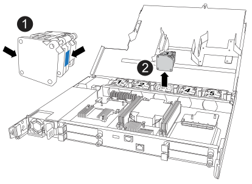

To replace a fan, you must remove the controller, remove the faulty fan, install the replacement fan, and then reinstall the controller.

.About this task
If needed, you can turn on the storage system location (blue) LEDs to aid in physically locating the affected storage system. Log into the BMC using SSH and enter the `system location-led _on_` command.

A storage system has three location LEDs: one on the operator display panel and one on each controller. Location LEDs remain illuminated for 30 minutes. 

You can turn them off by entering the `system location-led _off_` command. If you are unsure if the LEDs are on or off, you can check their state by entering the `system location-led show` command.

== Step 1: Shut down the impaired controller
 
Shut down or take over the impaired controller.

// Shut down or take over the impaired controller using one of the following options.
 
// [role="tabbed-block"]
// ====
 
// .Option 1: Most systems
// --
include::../_include/shutdown_most_frus.adoc[]
// --
// .Option 2: Controller is in a MetroCluster
// --
// include::../_include/shutdown_any_mcc_no_2-node_mcc.adoc[]
// --
 
// ====

== Step 2: Remove the controller

include::../_include/g_controller_remove.adoc[]

== Step 3: Replace fan

To replace a fan, remove the failed fan and replace it with a new fan.

. Identify the fan that you must replace by checking the console error messages.

. Remove the failed fan:
+

+
[cols="1,4"]
|===
a|
image::../media/legend_icon_01.svg[Callout number 1,width=30px]|
Hold both sides of the fan at the blue touch points.
a|
image::../media/legend_icon_02.svg[Callout number 2,width=30px]|
Pull the fan straight up and out its socket.
|===

+

.  Insert the replacement fan by aligning it within the guides, and then push down until the fan connector is fully seated in the socket.

== Step 4: Reinstall the controller module

Reinstall the controller into the chassis and reboot it.

include::../_include/g_controller_reinstall.adoc[]

== Step 5: Return the failed part to NetApp

include::../_include/complete_rma.adoc[]
