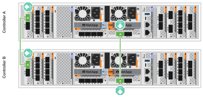
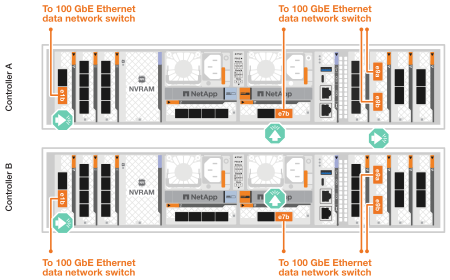
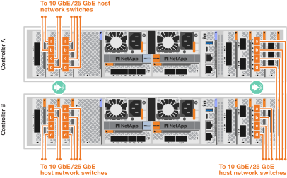
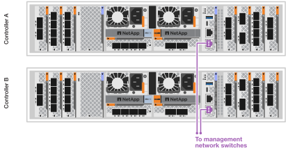
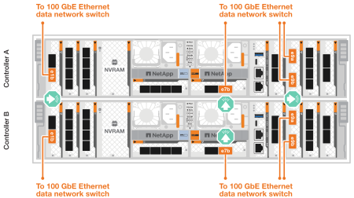
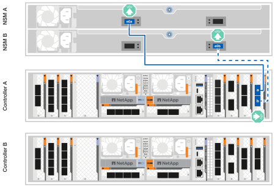
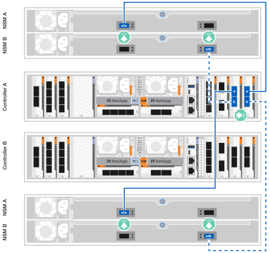
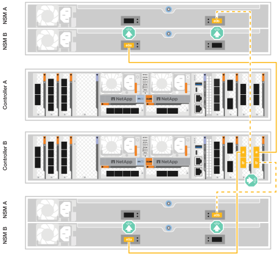

.Before you begin
Check the illustration arrow in the cabling diagrams for the proper cable connector pull-tab orientation.

image::../media/drw_cable_pull_tab_direction_ieops-1699.svg[Cable pull-tab orientation example]

* As you insert the connector, you should feel it click into place; if you do not feel it click, remove it, turn the cable head over and try again.
* If connecting to an optical switch, insert the small form-factor pluggable (SFP) transceiver into the controller port before cabling to the port.

== Step 1: Connect the storage controllers to your network
Connect your controllers directly to each other and to your host network.

.Before you begin
Contact your network administrator for information about connecting your storage system to the host network switches.

.About this task
These procedures show common configurations. The specific cabling depends on the components ordered for your storage system. For comprehensive configuration and slot priority details, see link:https://hwu.netapp.com[NetApp Hardware Universe^].

[role="tabbed-block"]
====

.ASA A1K storage system
--
Connect your storage controllers to each other to create the ONTAP cluster connections, and then connect the Ethernet ports on each controller to your host network.

.Steps

. Use the Cluster/HA interconnect cable to connect ports e1a to e1a and ports e7a to e7a.

+
NOTE: The cluster interconnect traffic and the HA traffic share the same physical ports.
+
.. Connect port e1a on Controller A to port e1A on Controller B.
.. Connect port e7a on Controller A to port e1A on Controller B.
+
*Cluster/HA interconnect cables*
+

+

+
. Connect the Ethernet module ports to your host network. 
+
The following are some typical host network cabling examples. See  link:https://hwu.netapp.com[NetApp Hardware Universe^] for your specific system configuration.

.. Connect ports e9a and e9b to your Ethernet data network switch as shown.
+
NOTE: For maximum system performance for cluster and HA traffic, it is a best practice to not use ports e1b and e7b ports for host network connections.  Use a separate host card to maximize performance.

+
*100 GbE cable*
+
image::../media/oie_cable_sfp_gbe_copper.svg[100Gb Ethernet cable,width=100px]
+

+
.. Connect your 10/25 GbE host network switches.
+
*10/25 GbE Host*
+
image::../media/oie_cable_sfp_gbe_copper.svg[10/25Gb Ethernet cable,width=100px]
+

+

. Use the 1000BASE-T RJ-45 cables to connect the controller management (wrench) ports to the management network switches.
+
image::../media/oie_cable_rj45.svg[RJ-45 cables,width=100px]
*1000BASE-T RJ-45 cables*
+

IMPORTANT: Do not plug in the power cords yet. 

--
.ASA A70 and ASA A90 storage systems
--
Connect your storage controllers to each other to create the ONTAP cluster connections, and then connect the Ethernet ports on each controller to your host network.

.Steps

. Use the the Cluster/HA interconnect cable to connect to connect ports e1a to e1a and ports e7a to e7a. 

+
NOTE: The cluster interconnect traffic and the HA traffic share the same physical ports.

+
.. Connect port e1a on Controller A to port e1A on Controller B.
.. Connect port e7a on Controller A to port e1A on Controller B.
+
*Cluster/HA interconnect cables*
+

+
image::../media/drw_70-90_tnsc_cluster_cabling_ieops-1653.svg[Two-node switchless cluster cabling diagram, width=500px]
+
. Connect the Ethernet module ports to your host network. 
+
The following are some typical host network cabling examples. See  link:https://hwu.netapp.com[NetApp Hardware Universe^] for your specific system configuration.

.. Connect ports e9a and e9b to your Ethernet data network switch as shown.
+
NOTE: For maximum system performance for cluster and HA traffic, it is a best practice to not use ports e1b and e7b ports for host network connections.  Use a separate host card to maximize performance.

+
*100 GbE cable*
+
image::../media/oie_cable_sfp_gbe_copper.svg[100Gb Ethernet cable, width=100px]
+

+
.. Connect your 10/25 GbE host network switches.
+
*4-ports, 10/25 GbE Host*
+
image::../media/oie_cable_sfp_gbe_copper.svg[10/25 Gb cable,width=100px]
+
image::../media/drw_70-90_network_cabling2_ieops-1655.svg[Cable to 100Gb Ethernet network,width=500px]
+

. Use the 1000BASE-T RJ-45 cables to connect the controller management (wrench) ports to the management network switches.
+
image::../media/oie_cable_rj45.svg[RJ45 cables,width=100px]
*1000BASE-T RJ-45 cables*
+
image::../media/drw_70-90_management_connection_ieops-1656.svg[Connect to your management network,width=500px]

IMPORTANT: Do not plug in the power cords yet. 

--

====

== Step 2: Connect your storage controllers to the storage shelves
The following cabling procedures show how to connect your controllers to one shelf and to two shelves. You can directly connect up to four shelves to your controllers.

// start tabbed area

[role="tabbed-block"]
====

.ASA A1K system
--
Choose one of the following cabling options that matches your setup.

// Start snippet: collapsible block (open on page load)
.Option 1: Cable your controllers to one NS224 storage shelf
[%collapsible]
=====

Connect each controller to the NSM modules on the NS224 shelf. The graphics show cabling from each of the controllers: Controller A cabling is shown in blue and Controller B cabling is shown in yellow.

.Steps

. On controller A, connect the following ports:
.. Connect port e11a to NSM A port e0a.
.. Connect port e11b to port NSM B port e0b.
+

. On controller B, connect the following ports:
.. Connect port e11a to NSM B port e0a.
.. Connect port e11b to NSM A port e0b.
+
image:../media/drw_a1k_1shelf_cabling_b_ieops-1704.svg[Cable controller B ports e11a and e11b to a single NS224 shelf]

=====
// End snippet

// Start snippet: collapsible block (open on page load)
.Option 2: Cable your controllers to two NS224 storage shelves
[%collapsible]
=====
Connect each controller to the NSM modules on both NS224 shelves. The graphics show cabling from each of the controllers: Controller A cabling is shown in blue and Controller B cabling is shown in yellow.

.Steps

. On controller A, connect the following ports:
.. Connect port e11a to shelf 1 NSM A port e0a.

.. Connect port e11b to shelf 2 NSM B port e0b.

.. Connect port e10a to shelf 2 NSM A port e0a.

.. Connect port e10b to shelf 1 NSM A port e0b.
+

+

. On controller B, connect the following ports:
.. Connect port e11a to shelf 1 NSM B port e0a.

.. Connect port e11b to shelf 2 NSM A port e0b.

.. Connect port e10a to shelf 2 NSM B port e0a.

.. Connect port e10b to shelf 1 NSM A port e0b.
+

=====
// End snippet
--

.ASA A70 and A90 systems
--
Choose one of the following cabling options that matches your setup.

// Start snippet: collapsible block (open on page load)
.Option 1: Connect your controllers to one NS224 storage shelf
[%collapsible]
=====

Connect each controller to the NSM modules on the NS224 shelf. The graphics show cabling from each of the controllers: Controller A cabling is shown in blue and Controller B cabling is shown in yellow.

*100 GbE QSFP28 copper cables*

.Steps
. Connect controller A port e11a to NSM A port e0a.
. Connect controller A port e11b to port NSM B port e0b.
+
image:../media/drw_a70-90_1shelf_cabling_a_ieops-1731.svg[Controller A e11a and e11b to a single NS224 shelf]

. Connect controller B port e11a to NSM B port e0a.
. Connect controller B port e11b to NSM A port e0b.
+
image:../media/drw_a70-90_1shelf_cabling_b_ieops-1732.svg[Controller B e11a and e11b to a single NS224 shelf]

=====
// End snippet

// Start snippet: collapsible block (open on page load)
.Option 2: Connect your controllers to two NS224 storage shelves
[%collapsible]
=====
Connect each controller to the NSM modules on both NS224 shelves. The graphics show cabling from each of the controllers: Controller A cabling is shown in blue and Controller B cabling is shown in yellow.

*100 GbE QSFP28 copper cables*

.Steps

. On on controller A, connect the following ports:
.. Connect port e11a to shelf 1, NSM A port e0a.

.. Connect port e11b to shelf 2, NSM B port e0b.

.. Connect port e8a to shelf 2, NSM A port e0a.

.. Connect port e8b to shelf 1, NSM B port e0b.
+
image:../media/drw_a70-90_2shelf_cabling_a_ieops-1733.svg[Controller-to-shelf connections for controller A]
+

. On controller B, connect the following ports:
.. Connect port e11a to shelf 1, NSM B port e0a.

.. Connect  port e11b to shelf 2, NSM A port e0b.

.. Connect port e8a to shelf 2, NSM B port e0a.

.. Connect port e8b to shelf 1, NSM A port e0b.
+
image:../media/drw_a70-90_2shelf_cabling_b_ieops-1734.svg[Controller-to-shelf connections for controller B]
=====
// End snippet

--

====

// end tabbed area

