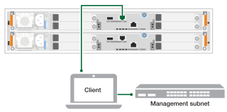

// to reference this file and have pdf work correctly, use one block based on context and uncomment it

// if the context is a1k and a70-90 and c80:

// :a1k-a70-90:
// include::../_include/install_power_controllers_conditional.adoc[]
// :a1k-a70-90!:

// if the context is a20-30-50 or c30-60:

// :fas50-a20-30-50:
// include::../_include/install_power_controllers_conditional.adoc[]
// :fas50-a20-30-50!:

// if the context is fas70-90:

// :fas70-90:
// include::../_include/install_power_controllers_conditional.adoc[]
// :fas-70-90!:

After you've powered on your shelves and assigned them unique IDs, power on the storage controllers.

.Steps

. Connect your laptop to the serial console port. This will allow you to monitor the boot sequence when the controllers are powered on.

.. Set the serial console port on the laptop to 115,200 baud with N-8-1.
+
NOTE: See your laptop's online help for instructions on how to configure the serial console port.

.. Using the console cable provided with your storage system, connect one end of the console cable to your laptop and the other end to the serial console port on controller A.
 
.. Connect the laptop to the switch on the management subnet.
+
// next image applies only to A1K and A70-90
ifdef::a1k-a70-90[]
image::../media/drw_a1k_70-90_console_connection_ieops-1702.svg[Console connections]
endif::a1k-a70-90[]
// next image applies only to FAS50 and A20-30-50
ifdef::fas50-a20-30-50[]

endif::fas50-a20-30-50[]
+
. Assign a TCP/IP address to the laptop, using one that is on the management subnet.
+
. Plug the power cords into the controller power supplies, and then connect them to power sources on different circuits.
+
// next image applies only to A1K and A70-90
ifdef::a1k-a70-90[]
image::../media/drw_affa1k_power_source_icon_ieops-1700.svg[A1K storage system and A70 or A90 power connection diagram]
endif::a1k-a70-90[]
// next image applies only to FAS50 and A20-30-50
ifdef::fas50-a20-30-50[]
image::../media/drw_psu_layout_1_ieops-1886.svg[A20 or A30 or A50 storage system power connection diagram]
endif::fas50-a20-30-50[]
+
* The system begins to boot. Initial booting might take up to eight minutes. 
+
* The LEDs flash on and the fans start, which indicates that the controllers are powering on.
+
* The fans might be very noisy when they first start up. The fan noise during start-up is normal.
+
// next bullet applies only to FAS50 and A20-30-50
ifdef::fas50-a20-30-50[]
+
* The shelf ID display on the front of the system chassis does not illuminate.
endif::fas50-a20-30-50[]
+
. Secure the power cords using the securing device on each power supply.
