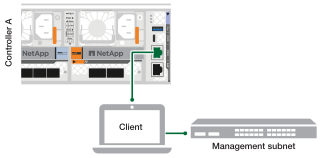

== Step 1: Power on the shelf and assign shelf ID
In ONTAP storage systems, each NS224 shelf is distinguished by a unique shelf ID. This ID ensures that the shelf is distinct within your storage system setup. By default, shelf IDs are assigned as ‘00’ and ‘01’, but you may need to adjust these IDs to maintain uniqueness across your storage system.

.About this task
* A valid shelf ID is 00 through 99.
* You must power cycle a shelf (unplug both power cords, wait the appropriate amount of time, and then plug them back in) for the shelf ID to take effect.

.Steps
. Power on the shelf by connecting the power cords first to the shelf, securing them in place with the power cord retainer, and then connecting the power cords to power sources on different circuits.
+
The shelf powers on and boots automatically when plugged into the power source. 

. Remove the left end cap to access the shelf ID button behind the faceplate.
+
image::../media/drw_a900_oie_change_ns224_shelf_id_ieops-836.svg[Change NS224 shelf ID,width=300px]

+

[cols="20%,80%"]
|===
a|
image::../media/legend_icon_01.svg[Callout number 1,width=20] 
a|
Shelf end cap
a|
image::../media/legend_icon_02.svg[[Callout number 2,width=20]
a|
Shelf faceplate 
a|
image::../media/legend_icon_03.svg[[Callout number 3,width=20]
a|
Shelf ID number
a|
image::../media/legend_icon_04.svg[[Callout number 4,width=20]
a|
Shelf ID access button

|===
+
. Change the first number of the shelf ID:
 .. Insert the straightened end of a paperclip or narrow tipped ball point pen into the small hole.
 .. Press and hold the button until the first number on the digital display blinks, and then release the button.
+
It can take up to 15 seconds for the number to blink. This activates the shelf ID programming mode.
+
NOTE: If the ID takes longer than 15 seconds to blink, press and hold the button again, making sure to press it in all the way.

 .. Press and release the button to advance the number until you reach the desired number from 0 to 9.
+
Each press and release duration can be as short as one second.
+
The first number continues to blink.
. Change the second number of the shelf ID:
 .. Press and hold the button until the second number on the digital display blinks.
+
It can take up to three seconds for the number to blink.
+
The first number on the digital display stops blinking.

 .. Press and release the button to advance the number until you reach the desired number from 0 to 9.
+
The second number continues to blink.
. Lock in the desired number and exit the programming mode by pressing and holding the button until the second number stops blinking.
+
It can take up to three seconds for the number to stop blinking.
+
Both numbers on the digital display start blinking and the amber LED on the ODP illuminates after about five seconds, alerting you that the pending shelf ID has not yet taken effect.

. Power-cycle the shelf for at least 10 seconds to make the shelf ID take effect.
+
.. Unplug the power cord from both power supplies on the shelf.
+
.. Wait 10 seconds.
+
.. Plug the power cords back into the shelf power supplies to complete the power cycle.
+
A power supply is powered on as soon as the power cord is plugged in. Its bicolored LED should illuminate green.

. Replace the left end cap.

== Step 2: Power on the controllers
Learn how to power on the controllers.

.Steps

. Connect your laptop to the serial console port so you can monitor the boot sequence when power is applied to the controllers. 

 .. Set the serial console port on the laptop to 115,200 baud with N-8-1.
+
NOTE: See your laptop's online help for instructions on how to configure the serial console port.

 .. Connect the console cable to the laptop, and connect the serial console port on the controller using the console cable that came with your platform.
 
.. Connect the laptop to the switch on the management subnet.
+

 
 .. Assign a TCP/IP address to the laptop, using one that is on the management subnet.
+
. Plug the power cords into the controller power supplies, and then connect them to power sources on different circuits.
+
image::../media/drw_affa1k_power_source_icon_ieops-1700.svg[Generic power connection diagram]
+
* The platform begins to boot. Initial booting may take up to eight minutes. 
+
* The LEDs flash on and the fans start, which indicates that the controllers are powering on.
+
* The fans might be very loud when they first start up. The loud fan noise during start-up is normal.

. Secure the power cables using the securing device on each power supply.
