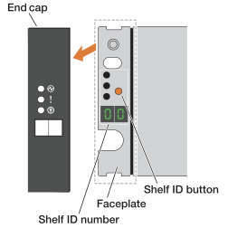

Each shelf is distinguished by a unique shelf ID. This ID ensures that the shelf is distinct within your storage system setup.

.About this task
* A valid shelf ID is 01 through 99. 
+
If you have internal shelves (storage), which are integrated within the controllers, they are assigned a fixed shelf ID of 00.

* You must power cycle a shelf (turn off the power switch at the rear of the SAS shelf, wait the appropriate amount of time, and then switch the power back on) for the shelf ID to take effect.

.Steps
. Power on the shelf by connecting the power cords first to the shelf, securing them in place with the power cord retainer, connecting the power cords to power sources on different circuits, and then turning on the power switch on each of the power supplies (at the rear of the shelf).
+
The shelf powers on and boots automatically when powered on. 

. Remove the left end cap to access the orange shelf ID button on the faceplate.
+

+

[cols="20%,80%"]
|===
a|
image::../media/icon_round_1.png[Callout number 1] 
a|
Shelf end cap
a|
image::../media/icon_round_2.png[[Callout number 2]
a|
Shelf faceplate 
a|
image::../media/icon_round_3.png[[Callout number 3]
a|
Shelf ID button
a|
image::../media/icon_round_4.png[[Callout number 4]
a|
Shelf ID number

|===
+
. Change the first number of the shelf ID:
.. Press and hold the shelf ID button until the first number on the digital display blinks, and then release the button.
+
It can take up to 15 seconds for the number to blink. This activates the shelf ID programming mode.
+
NOTE: If the ID takes longer than 15 seconds to blink, press and hold the shelf ID button again, making sure to press it in all the way.

.. Press and release the shelf ID button to advance the number until you reach the desired number from 0 to 9.
+
Each press and release duration can be as short as one second.
+
The first number continues to blink.
. Change the second number of the shelf ID:
.. Press and hold the button until the second number on the digital display blinks.
+
It can take up to three seconds for the number to blink.
+
The first number on the digital display stops blinking.

.. Press and release the shelf ID button to advance the number until you reach the desired number from 0 to 9.
+
The second number continues to blink.
. Lock in the desired number and exit the programming mode by pressing and holding the shelf ID button until the second number stops blinking.
+
It can take up to three seconds for the number to stop blinking.
+
Both numbers on the digital display start blinking and the amber LED illuminates after about five seconds, alerting you that the pending shelf ID has not yet taken effect.

. Power-cycle the shelf for at least 10 seconds to make the shelf ID take effect.
+
.. Turn off the power switch on each of the power supplies. 

+
.. Wait 10 seconds.
+
.. Turn on the power switch on each of the power supplies to complete the power cycle.
+
When a power supply is powered on, the bicolored LED should illuminate green.

. Replace the left end cap.

