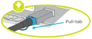
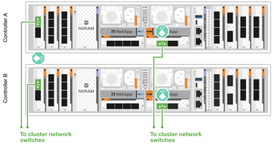

= Cable the controllers - AFF A1K
:icons: font
:imagesdir: ../media/

[.lead]
Cable your storage system and drive shelves according to your configuration.

== Step 1: Cable controllers to your network
Cable the controllers to your network as either a two-node switchless cluster or a switched cluster.

.Before you begin

* Contact your network administrator for information about connecting the storage system to the switches.
* Check the illustration arrow for the proper cable connector pull-tab orientation.
** As you insert the connector, you should feel it click into place; if you do not feel it click, remove it, turn the cable head over and try again.
** If connecting to an optical switch, insert the SFP into the controller port before cabling to the port.
+

.About this task
The AFF A1K storage system has 11 slots on its back panel.
Each slot can accommodate different cards. Certain slots are designated for specific purposes based on their priority. The priority of these slots determines which cards are installed where.

* NVRAM12
+
The NVRAM12 card is always installed in slot 4. It is a double-wide card and also occupies slot 5.

* System management module
+
Unlike the other 11 slots, the system management module has a unique placement.
It is located between slot 7 and slot 8.

* I/O modules
+
You can install I/O modules in the following slots: 1, 2, 3, and 6 through 11.

Keep in mind that the specific configuration and slot priorities depend on the system components ordered for your storage system. For comprehensive configuration and slot priority details, see link:https://hwu.netapp.com[NetApp Hardware Universe^] (HWU).

[role="tabbed-block"]
====

.Option 1: Cable switchless cluster
--
The cluster interconnect traffic and the HA traffic share the same physical ports.

.Steps

. Cable the Cluster+HA interconnect ports e1a to e1a and e7a to e7a with the Cluster+HA interconnect cable.
+
image::../media/oie_cable_25Gb_Ethernet_SFP28_IEOPS-1069.svg[width=100pxx]
*Cluster+HA interconnect cables*
+
image::../media/drw_a1k_tnsc_cluster_cabling_ieops-1648.svg[width=500px]
+
. Cable the Ethernet card ports to your host network. 
+
The following are some typical host network cabling examples. See  link:https://hwu.netapp.com[NetApp Hardware Universe^] (HWU) for your specific system configuration.

.. Cable ports e1b and e7b to your Ethernet data network switch. 
+
If present, cable ports e9a and e9b to your Ethernet data network switch as shown.
+
*100 GbE cable*
+
image::../media/oie_cable_sfp_gbe_copper.svg[width=100px]
+
image::../media/drw_a1k_network_cabling1_ieops-1649.svg[width=500px]

+
.. Cable your 10/25 GbE host network switches.
+
*4-ports, 10/25 GbE Host*
+
image::../media/oie_cable_sfp_gbe_copper.svg[width=100px]
+
image::../media/drw_a1k_network_cabling2_ieops-1650.svg[width=500px]
+
For example, if you have a 10/25 GbE card in slot 2 as shown, cable ports e2a through e2d to  to your 10/25GbE host network switches. If you have additional 10/25 GbE cards in your system (in other slots), follow the same procedure.

. Cable the controller management (wrench) ports to the management network switches with 1000BASE-T RJ-45 cables.
+
image::../media/oie_cable_rj45.svg[width=100px]
*1000BASE-T RJ-45 cables*
+
image::../media/drw_a1k_management_connection_ieops-1651.svg[width=500px]

IMPORTANT: DO NOT plug in the power cords yet. 

--
.Option 2: Cable switched cluster
--

The cluster interconnect traffic and the HA traffic share the same physical ports. 

.Steps

. Make the following cabling connections:
+
.. Cable port e1a on Controller A and port e1a on Controller B to cluster network switch A. 
.. Cable port e7a on Controller A and port e7a on Controller b to cluster network switch B.
+
*100 GbE cable*
+
image::../media/oie_cable100_gbe_qsfp28.svg[width=100px]
+

. Cable the Ethernet card ports to your host network. 
+
The following are some typical host network cabling examples. See  link:https://hwu.netapp.com[NetApp Hardware Universe^] (HWU) for your specific system configuration.

.. Cable ports e1b and e7b to your Ethernet data network switch. 
+
If present, cable ports e9a and e9b to your Ethernet data network switch as shown.
+
*100 GbE cable*
+
image::../media/oie_cable_sfp_gbe_copper.svg[width=100px]
+
image::../media/drw_a1k_network_cabling1_ieops-1649.svg[width=500px]

+
.. Cable your 10/25 GbE host network switches.
+
*4-ports, 10/25 GbE Host*
+
image::../media/oie_cable_sfp_gbe_copper.svg[width=100px]
+
image::../media/drw_a1k_network_cabling2_ieops-1650.svg[width=500px]
+
For example, if you have a 10/25 GbE card in slot 2 as shown, cable ports e2a through e2d to  to your 10/25GbE host network switches. If you have additional 10/25 GbE cards in your system (in other slots), follow the same procedure.

. Cable the controller management (wrench) ports to the management network switches with 1000BASE-T RJ-45 cables.
+
image::../media/oie_cable_rj45.svg[width=100px]
*1000BASE-T RJ-45 cables*
+
image::../media/drw_a1k_management_connection_ieops-1651.svg[width=500px]

IMPORTANT: DO NOT plug in the power cords yet. 

--

====

== Step 2: Cable controllers to drive shelves
You can cable your controllers to either one NS224 drive shelf or two NS224 drive shelves. 

.Before you begin
Check the illustration arrow for the proper cable connector pull-tab orientation.

* As you insert the connector, you should feel it click into place; if you do not feel it click, remove it, turn the cable head over and try again.
* If connecting to an optical switch, insert the SFP into the controller port before cabling to the port.

// start tabbed area

[role="tabbed-block"]
====

.Option 1: Cable to one NS224 drive shelf
--
Cable each controller to the NSM modules on the NS224 drive shelf.

image:../media/drw_ns224_vino_i_1shelf_1card_ieops-1639.svg[]

.Steps
. Connect controller A port e11a to port e0a on NSM A on the shelf.
. Connect controller A port e10b to port e0b on NSM B on the shelf.
. Connect controller B port e11a to port e0a on NSM B on the shelf.
. Connect controller B port e10b to port e0b on NSM A on the shelf.

|===
--

.Option 2: Cable to two NS224 drive shelves
--
Cable each controller to the NSM modules on both NS224 drive shelves.

image:../media/drw_ns224_vino_i_2shelves_2cards_ieops-1641.svg[]

.Steps

. On shelf 1, cable the following connections:
+
.. Connect controller A port e11a to NSM A e0a.

.. Connect controller A port e11b to NSM B e0b.

.. Connect controller B port e11a to NSM B e0.

.. Connect controller B port e11b to NSM A e0b.

. On shelf 2, cable the following connections:
+
.. Connect controller A port e10a to NSM A e0a.

.. Connect controller A port e11b to NSM B e0b.

.. Connect controller B port e11b to NSM A e0b.

.. Connect controller B port e10a to NSM B e0a.
   
|===
--

====

// end tabbed area

