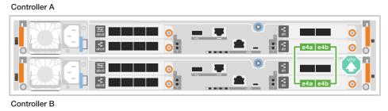
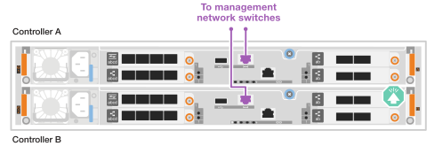

= Cable the hardware - AFF A20, AFF A30, and AFF A50
:icons: font
:imagesdir: ../media/

[.lead]
After you install your AFF A20, AFF A30, or AFF A50 storage system hardware, cable the controllers to the network and shelves.

.Before you begin

Contact your network administrator for information about connecting the storage system to your network switches.

.About this task
* The cluster/HA and host network cabling procedures show common configurations. Keep in mind that the specific cabling depends on the components ordered for your storage system. For comprehensive configuration and slot priority details, see link:https://hwu.netapp.com[NetApp Hardware Universe^].

* The cabling graphics have arrow icons showing the proper orientation (up or down) of the cable connector pull-tab when inserting a connector into a port.
+
As you insert the connector, you should feel it click into place; if you do not feel it click, remove it, turn it over and try again.
+
image:../media/drw_cable_pull_tab_direction_ieops-1699.svg[Cable pull tab direction]

* If cabling to an optical switch, insert the optical transceiver into the controller port before cabling to the switch port.

== Step 1: Cable the cluster/HA connections
Cable the controllers to your ONTAP cluster. This procedure differs depending on your storage system model and I/O module configuration.

[role="tabbed-block"]
====

.Switchless cluster cabling
--
Cable the controllers to each other to create the ONTAP cluster connections.

.AFF A30 or A50 with two 2-port 100GbE I/O modules
[%collapsible]

=====
The I/O module ports in slot 2 and 4 are 40/100GbE ports.???? Does this apply only to 30-50, if yes leave the 2 notes where the are, but if applies to all 3, then move it yo new paragraph below section lead text.????

.Steps

. Cable the Cluster/HA interconnect connections: 
+
NOTE: The cluster interconnect traffic and the HA traffic share the same physical ports.
+
.. Cable controller A port e2a to controller B port e2a.
.. Cable controller A port e4a to controller B port e4a.
+
NOTE: Ports e2b and e4b on the I/O modules in slots 2 and 4 are unused and available for front-end (host network) connectivity, if needed.
+
*Cluster/HA interconnect cables*
+
image::../media/oie_cable_25Gb_Ethernet_SFP28_IEOPS-1069.svg[Cluster HA cable, width=100pxx]
+
image::../media/drw_isi_a30-50_switchless_2p_100gbe_2card_cabling_ieops-2011.svg[Two-node switchless cluster cabling diagram using two 100gbe io modules]

=====

.AFF A30 or A50 with one 2-port 100GbE I/O module
[%collapsible]

=====
The I/O module ports in slot 2 and 4 are 40/100GbE ports.????

.Steps

. Cable the Cluster/HA interconnect connections: 
+
NOTE: The cluster interconnect traffic and the HA traffic share the same physical ports.
+
.. Cable controller A port e4a to controller B port e4a.
.. Cable controller A port e4b to controller B port e4b.
+
*Cluster/HA interconnect cables*
+
image::../media/oie_cable_25Gb_Ethernet_SFP28_IEOPS-1069.svg[Cluster HA cable, width=100pxx]
+

=====

.AFF A20 with one 2-port 10/25GbE I/O module
[%collapsible]

=====

Add example
+
image:../media/oie_cable_sfp_gbe_copper.png[GbE SFP copper connector]
// Connector used in Bandit, use it here?
+

=====

--
.Switched cluster cabling
--
Cable the controllers to the cluster network switches to create the ONTAP cluster connections.

.AFF A30 or A50 with two 2-port 100GbE I/O modules
[%collapsible]

=====

Add example

Add note: The 40/100GbE ports e2b and e4b on the I/O modules in slots 2 and 4 are unused and available for front-end connectivity, if needed.

=====

.AFF A30 or A50 with one 2-port 100GbE I/O module
[%collapsible]

=====

.Steps

. Cable the controllers to the cluster network switches:
+
NOTE: The cluster interconnect traffic and the HA traffic share the same physical ports.
+
.. Cable Controller A port e4a and Controller B port e4a to cluster network switch A. 
.. Cable Controller A port e4b and Controller B port e4b to cluster network switch B.
+
*Cluster/HA interconnect cables*
+
image::../media/oie_cable100_gbe_qsfp28.png[100 Gb cable,width=100px]
+
image::../media/drw_isi_a30-50_2p_100gbe_switched_cabling_ieops-1926.svg[Cable cluster connections to cluster network,width=500px]

=====

.AFF A20 with one 2-port 10/25GbE I/O module
[%collapsible]

=====

Add example

=====

--

====

== Step 2: Cable the host network connections
Cable the controllers to your host network. This procedure differs depending on your storage system model and I/O module configuration. Host connectivity is 40/100 GbE.???

.AFF A30 or A50 with two 2-port 100GbE I/O modules
[%collapsible]

====

Text

====

.AFF A30 or A50 with one 2-port 100GbE I/O module
[%collapsible]

====

. Cable the host network connections.  
+
The following substeps are examples of optional host network cabling. If needed, see link:https://hwu.netapp.com[NetApp Hardware Universe^] for your specific storage system configuration.

.. Optional: Cable to 40/100GbE host network switches.
+
Cable ports e2a, e2b, e2c and e2d on each controller to the Ethernet host network switches.
+
*40/100 GbE cables*
+
image::../media/oie_cable_sfp_gbe_copper.png[40/100 Gb cable,width=100px]
+
image::../media/drw_isi_a30-50_host_2p_40-100gbe_1card_cabling_ieops-1923.svg[Cable to 40/100gbe ethernet host network switches]
+
.. Optional: Cable to FC host network switches.
+
Cable ports 1a, 1b, 1c and 1d on each controller to the FC host network switches.
+
*64 Gb/s FC cables*
+
image::../media/oie_cable_sfp_gbe_copper.png[64 Gb fc cable,width=100px]
+
image::../media/drw_isi_a30-50_4p_64gb_fc_1card_cabling_ieops-1924.svg[Cable to 64gb fc host network switches]

====

.AFF A20 with one 2-port 100GbE module
[%collapsible]

====

add text

====

== Step 3: Cable the management network connections
Cable the controllers to your management network.

. Cable the management (wrench) ports on each controller to the management network switches.
+
*1000BASE-T RJ-45 cables*
+
image::../media/oie_cable_rj45.png[RJ-45 cables]
+

IMPORTANT: Do not plug in the power cords yet. 

== Step 4: Cable the shelf connections
This procedure show you how to cable the controllers to one NS224 shelf.

.About this task

* For the maximum number of shelves supported for your storage system and for all of your cabling options, such as optical and switch-attached, see link:https://hwu.netapp.com[NetApp Hardware Universe^].

* You cable each controller to each NSM100B module on the NS224 shelf using the storage cables that came with your storage system, which could be the following cable type:
+
*100 GbE QSFP28 copper cables*
+
image::../media/oie_cable100_gbe_qsfp28.png[100 GbE QSFP28 copper cable,width=100px]
* The graphics show controller A cabling in blue and controller B cabling in yellow. 

.Steps

. Cable controller A to the shelf:
.. Cable controller A port e3a to NSM A port e1a.
.. Cable controller A port e3b to NSM B port e1b.
+
image:../media/drw_isi_g_1_ns224_controller_a_cabling_ieops-1945.svg[Controller A ports e3a and e3b cabled to one NS224 shelf]

. Cable controller B to the shelf:
.. Cable controller B port e3a to NSM B port e1a.
.. Cable controller B port e3b to NSM A port e1b.
+
image:../media/drw_isi_g_1_ns224_controller_b_cabling_ieops-1946.svg[Controller B ports e3a and e3b cabled to one NS224 shelf]

.What's next?

After you’ve cabled the hardware for your storage system, you link:install-power-hardware.html[power on the storage system].

