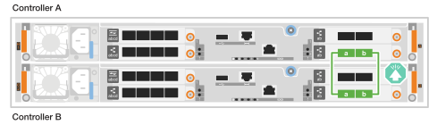
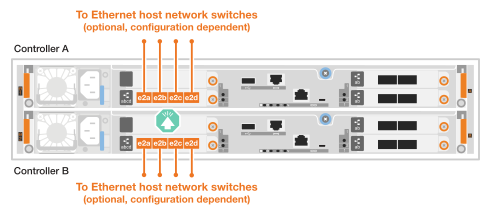
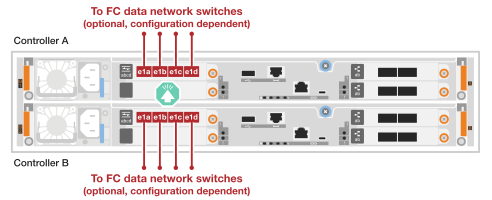
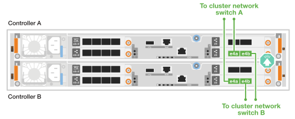

= Cable the hardware - AFF A20, AFF A30, and AFF A50
:icons: font
:imagesdir: ../media/

[.lead]
After you install your AFF A20, AFF A30, or AFF A50 storage system hardware, cable the controllers to the network and shelves.

.About this task
* The cabling graphics have arrow icons showing the proper orientation (up or down) of the cable connector pull-tab when inserting a connector into a port.
+
As you insert the connector, you should feel it click into place; if you do not feel it click, remove it, turn it over and try again.
+
image:../media/drw_cable_pull_tab_direction_ieops-1699.svg[Cable pull tab direction]

* If cabling to an optical switch, insert the small form-factor pluggable (SFP) transceiver into the controller port before the switch port.

== Step 1: Cable the controllers to your network
Cable the controllers to your host network.

.Before you begin

Contact your network administrator for information about connecting the storage system to the switches.

.About this task
These procedures show common configurations. Keep in mind that the specific cabling depends on the components ordered for your storage system. For comprehensive configuration and slot priority details, see link:https://hwu.netapp.com[NetApp Hardware Universe^].

[role="tabbed-block"]
====

.Option 1: Cable the controllers to a switchless ONTAP cluster
--
Cable the controllers to each other to create the ONTAP cluster connections, and then cable the host network connections.

.Steps

. Cable the Cluster/HA interconnect connections: 
+
NOTE: The cluster interconnect traffic and the HA traffic share the same physical ports.
+
.. Cable controller A port e4a to controller B port e4a.
.. Cable controller A port e4b to controller B port e4b.
+
*Cluster/HA interconnect cables*
+
image::../media/oie_cable_25Gb_Ethernet_SFP28_IEOPS-1069.svg[Cluster HA cable, width=100pxx]
+

. Cable the host network connections. 
+
The following substeps are examples of optional host network cabling. If needed, see link:https://hwu.netapp.com[NetApp Hardware Universe^] for your specific storage system configuration.

.. Optional: Cable to 10/25GbE host network switches.
+
Cable ports e2a, e2b, e2c and e2d on each controller to the Ethernet host network switches.
+
*10/25 GbE cables*
+
image::../media/oie_cable_sfp_gbe_copper.png[10/25 Gb cable,width=100px]
+

+
.. Optional: Cable to FC host network switches.
+
Cable ports e1a, e1b, e1c and e1d on each controller to the FC host network switches.
+
*64 Gb FC cables*
+
image::../media/oie_cable_sfp_gbe_copper.png[64 Gb fc cable,width=100px]
+

+

. Cable the management (wrench) ports on each controller to the management network switches.
+
*1000BASE-T RJ-45 cables*
+
image::../media/oie_cable_rj45.png[RJ45 cables,width=100px]
+
image::../media/drw_isi_g_wrench_cabling_ieops-1928.svg[Connect to your management network,width=500px]

IMPORTANT: Do not plug in the power cords yet. 

--
.Option 2: Cable the controllers to a switched ONTAP cluster
--
Cable the controllers to the cluster network switches to create the ONTAP cluster connections, and then cable the host network connections.

.Steps

. Cable the controllers to the cluster network switches:

+
NOTE: The cluster interconnect traffic and the HA traffic share the same physical ports.

+
.. Cable Controller A port e4a and Controller B port e4a to cluster network switch A. 
.. Cable Controller A port e4b and Controller B port e4b to cluster network switch B.
+
*100 GbE cable*
+
image::../media/oie_cable100_gbe_qsfp28.png[100 Gb cable,width=100px]
+

. Cable the host network connections.  
+
The following substeps are examples of optional host network cabling. If needed, see link:https://hwu.netapp.com[NetApp Hardware Universe^] for your specific storage system configuration.

.. Optional: Cable to 10/25GbE host network switches.
+
Cable ports e2a, e2b, e2c and e2d on each controller to the Ethernet host network switches.
+
*10/25 GbE cables*
+
image::../media/oie_cable_sfp_gbe_copper.png[10/25 Gb cable,width=100px]
+

+
.. Optional: Cable to FC host network switches.
+
Cable ports e1a, e1b, e1c and e1d on each controller to the FC host network switches.
+
*64 Gb FC cables*
+
image::../media/oie_cable_sfp_gbe_copper.png[64 Gb fc cable,width=100px]
+

+

. Cable the management (wrench) ports on each controller to the management network switches.
+
*1000BASE-T RJ-45 cables*
+
image::../media/oie_cable_rj45.png[RJ45 cables,width=100px]
+
image::../media/drw_isi_g_wrench_cabling_ieops-1928.svg[Connect to your management network,width=500px]

IMPORTANT: Do not plug in the power cords yet. 

--

====

== Step 2: Cable the controllers to the shelves
This procedure shows how to cable the controllers to one NS224 shelf.

For the maximum number of shelves supported for your storage system, see link:https://hwu.netapp.com[NetApp Hardware Universe^].

.About this task
* You cable each controller to each NSM module on the NS224 shelf using the following cable type:
+
*100 GbE QSFP28 copper cables*
+
image::../media/oie_cable100_gbe_qsfp28.png[100 GbE QSFP28 copper cable,width=100px]
* The graphics show controller A cabling in blue and controller B cabling in yellow. 

.Steps

. Cable controller A to the shelf:
.. Cable controller A port e3a to NSM A port e1a.
.. Cable controller A port e3b to NSM B port e1b.
+
image:../media/drw_isi_g_1_ns224_controller_a_cabling_ieops-1945.svg[Controller A ports e3a and e3b cabled to one NS224 shelf]

. Cable controller B to the shelf:
.. Cable controller B port e3a to NSM B port e1a.
.. Cable controller B port e3b to NSM A port e1b.
+
image:../media/drw_isi_g_1_ns224_controller_b_cabling_ieops-1946.svg[Controller B ports e3a and e3b cabled to one NS224 shelf]

.What's next?

After you’ve cabled the hardware for your storage system, you link:install-power-hardware.html[power on the storage system].

